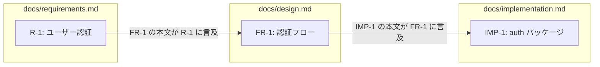
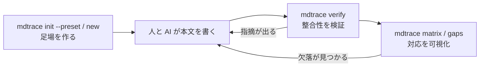

# mdtrace

複数の Markdown 文書を、識別子でつながった 1 つのグラフとして扱うコマンドです。

上流の記述が下流でどう扱われているかは、本来なら人が突き合わせる作業になります。
mdtrace は文書に付けた識別子からその関係を機械的に取り出し、検証・可視化します。
AI エージェントに文書を書かせる場面では、出力を受け取る側の検査装置として働きます。

`mdtrace` の 1 つの実行ファイルに、4 つの関心がサブコマンドとして入っています。

| 関心 | サブコマンド |
|---|---|
| 足場を作る | `init` `new` `templates` `id` |
| 整合性を見る | `verify` |
| 文書を読む | `search` `list` `show` |
| 対応を辿る | `matrix` `impact` `gaps` `graph` |

---

## 考え方

### 識別子と文書の連鎖

文書タイプごとに識別子の書式を決め、見出しの先頭に付けます。
どんな種類の文書を何段に連ねるかは設定で決めます。

```markdown
docs/requirements.md      docs/design.md              docs/implementation.md
## R-1: ユーザー認証       ## FR-1: 認証フロー          ## IMP-1: auth パッケージ
```

### 対応関係は本文の言及から作られる

対応表のような別ファイルは持ちません。下流の文書が上流の識別子に触れると、そこに線が引かれます。

```markdown
## FR-1: 認証フロー

R-1 を実現する。          ← この 1 行が R-1 → FR-1 の対応になる
```



- 見出しの先頭にある識別子が「定義」になり、グラフの頂点になります
- 本文中の識別子が「参照」になり、辺になります
- 辺の向きは上流から下流です。どちらの文書に書くかで向きが決まります

識別子を持つ見出しを入れ子にすると、親から子へも辺が張られます。
本文の言及による辺とは区別され、コマンドごとに辿る辺が違います
（[docs/reference.md](docs/reference.md) の「対応を辿るコマンド」）。

### 検証と可視化



---

## 使いどころ

同じ仕組みが、上流から下流への網羅を見たい場面すべてに使えます。
**連鎖の段数も文書タイプの名前も設定で決まる**ので、道具の側は進め方の語彙を持ちません。

| 構成の例 | 連鎖 | `matrix` が答えるもの |
|---|---|---|
| 監査対応 | 規制条項 → 手順 → 証跡 | どの条項に証跡が無いか |
| テスト設計 | テスト観点 → テストケース → 自動テスト | どの観点が自動化されていないか |
| 決定記録 | 決定 → 影響を受ける設計 → 実装 | どの決定が実装に反映されていないか |
| 障害対応 | インシデント → 原因 → 再発防止策 → 実施記録 | どの原因に対策が無いか |

組み込みのプリセットは 1 つで、`waterfall` という名前です。
要件定義 → アーキテクチャ設計 → 基本設計 → 詳細設計 → テスト設計 の 5 段です。
mdtrace 自身の文書もこの構成で書かれています（[docs/](docs/) 以下）。
上の表のような構成は `mdtrace.yaml` を書けば同じように扱えます。

---

## インストール

```bash
go install github.com/roamer7038/mdtrace/cmd/mdtrace@latest
```

リポジトリから直接ビルドする場合:

```bash
git clone <repository> && cd mdtrace
make build          # bin/mdtrace
make test           # テスト
```

`go.mod` は Go 1.26.5 を要求します。

---

## 使いはじめる

### 1. 設定と雛形を作る

```bash
mdtrace init --preset waterfall
# mdtrace.yaml と sections.yaml を作成しました
```

`mdtrace.yaml` に文書構成と依存関係、`sections.yaml` に文書タイプごとの必須セクションが入ります。
必須セクションは雛形が実際に生成する見出しから導かれるので、両者が食い違うことはありません。

### 2. 文書の雛形を生成する

```bash
mdtrace new requirements  -o docs/requirements.md --feature "ユーザー認証"
mdtrace new architecture  -o docs/architecture.md --based-on docs/requirements.md
mdtrace new basic-design  -o docs/basic-design.md --based-on docs/architecture.md
```

`--based-on` を付けると、参照元の識別子が `<!-- REF: REQ-1 -->` として雛形に埋め込まれます。
識別子は既存文書の続きから採番されるため、同じ文書タイプを複数ファイルに分けても衝突しません。

使える雛形の種類は `mdtrace templates` で一覧できます。

### 3. 本文を書く

雛形の `<!-- TODO: ... -->` を埋めていきます。ここが人と AI の担当範囲です。
見出しを追記したら `mdtrace id docs/requirements.md` で採番します。

### 4. 検証する

```bash
mdtrace verify 'docs/**/*.md'
```

```
✅ ref_integrity: 誤り 0 件
✅ term_consistency: 誤り 0 件
✅ required_sections: 誤り 0 件
✅ id_uniqueness: 誤り 0 件
✅ dep_order: 誤り 0 件
✅ id_hierarchy: 誤り 0 件

合計: 誤り 0 件, 警告 0 件（3 ファイル）
```

指摘があるときは、ファイル名と行番号、そしてそう判断した根拠が付きます。

```
❌ term_consistency: 誤り 1 件
   - docs/design.md:6: 別表記「機能要件」が使われています（正式な用語: FR）（機能要件 (Functional Requirement)。）
```

### 5. 対応を確認する

```bash
mdtrace matrix
mdtrace gaps
mdtrace impact REQ-1
```

```
| requirements | architecture | basic-design | detailed-design | test-design | 状態 |
|---|---|---|---|---|---|
| REQ-1 | ARC-1 | BD-1 | - | - | ⚠️ |
| REQ-2 | ARC-1 | BD-1 | - | - | ⚠️ |
```

下流をこれから書く段階なので、まだ最終段まで届いていません。
書き進めるにつれて ⚠️ が ✅ へ変わり、対応を書き忘れた要件だけが ❌ で残ります。

列見出しは設定の `chain` から取られるので、構成を変えれば表も追従します。

---

## コマンド一覧

```
mdtrace init --preset <名前>  構成の型から設定と必須セクション定義を作る
mdtrace new <type>            文書の雛形を生成する
mdtrace templates             使える雛形の種類を一覧する
mdtrace id <files...>         見出しへ識別子を付与する

mdtrace verify [files...]     整合性の検証（--rules --strict --format）

mdtrace search <pattern>      本文と見出しから語を探し、一致した節を返す
mdtrace list                  識別子の索引（--type --format text|tree|json）
mdtrace show <ID>             識別子が指すセクションの本文

mdtrace matrix                対応表（markdown / json。--from で起点の段を選ぶ）
mdtrace impact <ID>           影響範囲（--depth）
mdtrace gaps                  連鎖の最終段まで辿り切れない識別子
mdtrace graph                 依存グラフ（Mermaid）
```

終了コードは `0` 合格 / `1` 不合格 / `2` 設定や引数の不備 です。

---

## 設定ファイル

すべてのサブコマンドが同じ設定を共有します。既定では `mdtrace.yaml` を探し、`--config` で明示もできます。

```yaml
chain: [control, procedure, evidence]

files:
  - path: docs/controls.md
    type: control
    id_pattern: "CTL-{seq}"
  - path: docs/procedures.md
    type: procedure
    id_pattern: "PRC-{seq}"
    depends_on: [docs/controls.md]
  - path: docs/evidence.md
    type: evidence
    id_pattern: "EVD-{seq}"
    depends_on: [docs/procedures.md]
  - path: docs/glossary.md
    type: glossary
    id_pattern: "TERM-{seq}"
```

`preset` は `mdtrace new` が雛形を引く先です。組み込みの型を使わない構成では書かず、
自前の雛形を使うなら `templates:` で指します。

`chain` に載せた文書タイプは、必須セクション定義（既定 `sections.yaml`）にも
項目が要ります。検査が不要なら `rules.required_sections.enabled: false` と書きます。

`chain` が対応表の段になります。`chain` に載せない文書タイプ（用語集など）は、
どこから参照しても依存順序の検査に引っかかりません。

`path` と `depends_on` にはまとめ指定を書けるので、文書が増えても宣言は増えません。

詳しくは [docs/reference.md](docs/reference.md) を見てください。

---

## 継続的インテグレーションへの組み込み

```yaml
- name: 文書を検証する
  run: mdtrace verify 'docs/**/*.md'

- name: 欠落を確認する
  run: mdtrace gaps

- name: 対応表を保存する
  run: mdtrace matrix --output traceability.md
```

色は端末以外への出力では付きません。`--format json` を付けると、
`verify` も追跡系のコマンドも機械可読な出力を返します。

---

## AI エージェントから使う

文書が複数ファイルに分かれても、Markdown を直接読まずに構造を取得できます。

```bash
mdtrace search 認証 --format json   # 語から該当する節を探す（入口）
mdtrace list --format tree          # 全体を見渡す（関係を含まない軽い目次）
mdtrace show FR-1                   # 必要な節だけを取り出す
mdtrace verify --format json        # 指摘をファイル名と行番号付きで受け取る
```

識別子を知らない状態では `search` から入ります。一致した行がそのまま返るので、
本文を開かずに「どの節を読むべきか」を判断できます。

詳しい流れは [docs/reference.md](docs/reference.md) の「エージェントから使う」を参照してください。

---

## 関連文書

mdtrace 自身の文書が、この道具の使い方の実例になっています。

| 文書 | 内容 |
|---|---|
| [docs/requirements.md](docs/requirements.md) | 何を達成するか。観測可能な受け入れ条件 |
| [docs/architecture.md](docs/architecture.md) | 全体を貫く構造方針と、その理由 |
| [docs/basic-design.md](docs/basic-design.md) | 外部仕様。コマンドの契約と判定基準 |
| [docs/detailed-design.md](docs/detailed-design.md) | 内部仕様。パッケージごとの構造 |
| [docs/test-design.md](docs/test-design.md) | 何をどう検査するか |
| [docs/reference.md](docs/reference.md) | 操作の手引き。コマンドとフラグ、つまずきやすい点 |
| [docs/glossary.md](docs/glossary.md) | 用語集 |
| `testdata/` | 検証が通る構成と、各ルールに引っかかる構成 |
