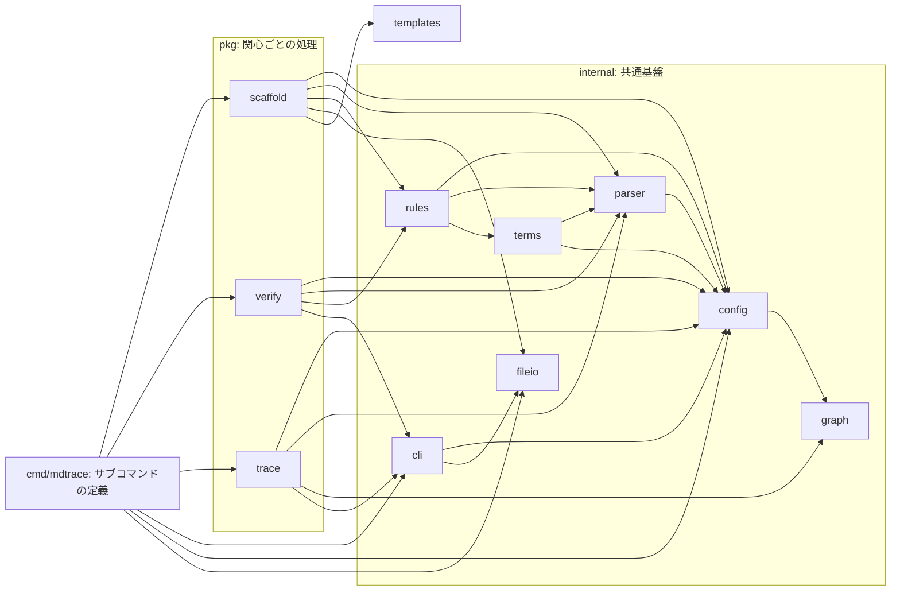
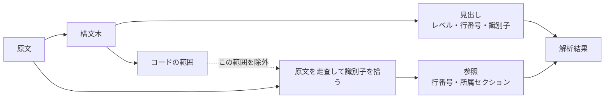
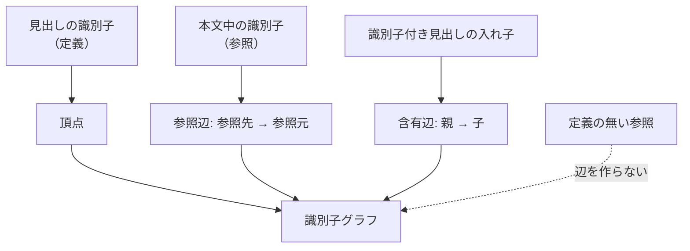
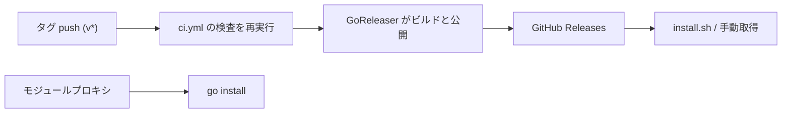

# アーキテクチャ設計: mdtrace

本書は、要件を満たすためにどんな構造を選び、なぜそれを選んだかを定める。
ここで決めるのは全体を貫く方針であり、個々のコマンドの外部仕様は基本設計が、
内部の作りは詳細設計が受け持つ。

貫く方針は 2 つある。
**特定の進め方に固有の語彙を道具の中核に持ち込まない**ことと、
**利用者が書いた文書を壊さない**ことである。
以降の決定はすべて、この 2 つのどちらかに帰着する。

### 本書の位置づけ

本書は要件定義を受け、基本設計へ渡す。各項目の冒頭で、対応する要件の識別子に言及する。
この言及がそのまま対応関係になるので、対応表を別に持たない。

**下流へ渡らない決定がある。**
層の構成（ARC-2）とライブラリの選定（ARC-12）は、
外部から観測できる約束を持たないため基本設計が受けようがない。
`mdtrace gaps --from architecture` はこの 2 つを欠落として報告するが、
これは書き漏れではなく、**横断的な決定が連鎖に乗らないという構造そのもの**である。
連鎖に乗せるために作り物の外部仕様を書くほうが害が大きいので、欠落のまま残す。
横断的な決定は項目の冒頭に「どの要件にも属さない」と宣言し、
宣言した項目と欠落が過不足なく一致することは機械で照合する。

### 設計の読み方

各項目は次の 3 節で構成する。

| 節 | 書く内容 |
|---|---|
| 構成 | 何をどう組み立てるか |
| 決定と根拠 | なぜその形にしたか。却下した案とその理由 |
| 影響 | この決定が下流の設計に課す制約 |

「決定と根拠」を独立した節にしているのは、理由を書かない設計文書が
**変更のたびに同じ議論をやり直させる**ためである。
却下した案を残すのは、後から見て「検討し忘れ」と「検討して却下」を区別するためである。

## ARC-1: 単一の実行ファイルと関心の分類

REQ-5 から REQ-12 までが同じ設定・同じ解析結果・同じ用語集を入力にすることを、
1 つの実行ファイルへ束ねることで保証する。
REQ-15 が制約する「1 つの実行ファイルで、他のランタイムに依存しない」という形は、
この決定がそのまま満たす。

### 構成
実行ファイルは `mdtrace` 1 つとし、サブコマンドとして機能を並べる。
サブコマンドは利用者から見た 4 つの関心に分類する。

| 関心 | 担うこと |
|---|---|
| 足場を作る | 設定・雛形・識別子を用意する |
| 整合性を見る | 決めた形が守られているかを検査する |
| 文書を読む | 本文と識別子を返す |
| 対応を辿る | 識別子どうしの関係を返す |

サブコマンド名は最大 2 語に収める。

### 決定と根拠
分けずに束ねるのは、すべてのサブコマンドが同じ設定・同じ解析結果・同じ用語集を
入力にするためである。実行ファイルを分けると、設定の読み込みと文書の解析が
それぞれの実行ファイルで重複し、版のずれが検査の抜けになる。

**「読む」と「辿る」を分類の上で分ける**のは、返るものが違うからである。
前者は本文と識別子を返し、後者は関係を返す。
利用者が「どちらを使えばよいか」を返り値の種類で選べるようにする。

### 影響
分類は `--help` の説明文が正典となり、利用者向け文書はそれに追従する。
分類と実際のサブコマンドの対応は機械で突き合わせる。
コマンド層は処理を持たない。処理を持つと、同じ判断が
サブコマンドごとに書き分けられ、束ねた意味が失われる。

## ARC-2: 層の構成と依存の一方向性

どの要件にも属さない横断決定。ここで決めた境界が、以降のすべての決定の置き場を決める。

### 構成
下の層ほど汎用で、上の層ほど利用者に近い。依存は上から下への一方向とし、循環を持たない。

利用者から見た関心は 4 つだが、`pkg/` は 3 パッケージである。
本文を取り出す処理と関係を辿る処理は、どちらも解析済みのグラフを入力にするため 1 つにまとめる。

### 決定と根拠
`internal` と `pkg` を分けるのは、**共有される基盤と、関心ごとの処理を見分けるため**である。
`pkg` は単一の関心だけが使う処理を持ち、`internal` は複数の関心が共有する基盤を持つ。
どこを直せば波及がその関心の中に留まるかが、置き場から読める。

**外部のモジュールから使える公開インタフェースとしては設計していない。**
`pkg` の入口はいずれも設定の型を要求し、その型を組み立てる手段は `internal` にある。
外向けの API にすると互換の責任が生まれるので、必要になるまで踏み込まない。

**利用者から見た分類と実装の分割単位を一致させない。**
一致させようとすると、同じグラフを入力にする 2 つのパッケージが生まれ、
構築の手順が二重になる。分類は利用者の選び方の話であり、分割は入力の共有の話である。

### 影響
この図はレビューで目視せず、実際の import と機械で突き合わせる。
図は文章と違って読み手が構造をそのまま信じるので、ずれたときの誤解が大きい。
描くなら全部描く、という約束にする。

## ARC-3: 構造の解釈と書き込みの分離

REQ-4 の採番と REQ-13 の無破壊を両立させるための、最も重い制約である。

### 構成
Markdown の構造解釈は構文解析器に集約し、**書き込みは行単位に限る**。
文書を読むときは構文木を作り、書き換えるときは解析結果が示した行だけを差し替える。
構文解析器は CommonMark に準拠した実装を使い、文書は UTF-8 として読む（REQ-15）。

参照の走査だけは構文木ではなく原文に対して行い、コードの範囲を除外する。
注釈形式で書かれた参照は構文木では本文として扱われないため、構文木だけでは拾えない。

### 決定と根拠
**Markdown を往復できる Go のライブラリは存在しない。**
候補を実際の文書で試した結果、いずれも往復で書式が壊れた
（チェックボックスの HTML 化、行の連結、空行の挿入）。
人が書いた文書が採番のたびに再整形されるのは受け入れられない。

構文木から書き戻す道を捨てる代わりに、解釈は構文解析器へ完全に寄せる。
両方を中途半端に持つと、「解析はこう読むが書き込みはこう見る」という
ずれが必ず入り込む。

### 影響
文書を書き換える処理は、元の改行コード・見出し形式・利用者が書いたコメントを保つ。
書き換えの対象は見出し行と挿入行だけになり、Markdown の再整形は行わない。
検証・採番・検索・用語判定は**同じ解析結果**を入力にしなければならない。
別々に走査すると、検索だけが使用例を拾うといった食い違いが出る。

## ARC-4: 中核データモデル

REQ-6 の構成検査、REQ-9 の対応表、REQ-11 の検索、REQ-12 の索引が、
同じ文書の読み方を共有するための土台である。

### 構成
解析結果は文書 1 件ごとに、見出しの一覧・参照の一覧・本文の行・改行コードを持つ。

| 概念 | 定義 |
|---|---|
| 定義 | 見出しの**先頭**にあり、その文書の識別子の書式に一致する識別子 |
| 参照 | それ以外の位置にある識別子。直近の識別子付き見出しに帰属する |
| 主レベル | **その文書**に実在する識別子付き見出しの、最も浅いレベル |

主レベルの見出しがその文書の主要素、それより深いレベルは主要素の細目にあたる。

### 決定と根拠
**主レベルを設定項目にせず、実データから導く。**
設定項目にすると、採番するレベルを増やすたびに宣言が増える。
そして主レベルの概念が無いと、深い見出しへ識別子を振った瞬間に
構成検査が全滅し（細目は下位の見出しを持たないため）、
対応表の分母が親子で二重に数えられる。

**単位を文書タイプではなく文書とする。**理由は 2 つある。
同じタイプを複数ファイルへ分けたとき、一方を浅いレベル・他方を深いレベルで書いても
後者の識別子が対応表の行から落ちない。そして解析対象の集合に依らないので、
全体を検証しても 1 ファイルだけを検証しても同じ結果になる。
親子の区別はもともと同一文書内の話なので、これで足りる。

**本文の行は解析結果がまとめて返す。**語ごとに文書を走査し直すと、
解析が語数に比例して重なる。そしてこの行を検索・用語判定・参照の抽出が共有することで、
検索だけが使用例を拾うという食い違いが原理的に起きなくなる。
一致の帰属も参照の帰属と同じ規則にする。読み手が「どの節を読むべきか」を判断する経路と、
対応関係を作る経路が別々の規則で動くと、片方だけが正しい状態が生まれる。

### 影響
構成検査と対応表の行は主レベルだけを見る。
対応表の列・検索・影響範囲・索引・本文取得はレベルを問わない。
深い見出しに識別子を振っても必須セクションを求められないが、
細目として関係の追跡には現れる。

## ARC-5: 宣言を唯一の正典とする

REQ-1 の中心であり、REQ-2 と REQ-4 の振る舞いもここから決まる。

### 構成
文書タイプ・識別子の書式・依存関係・連鎖は、すべて設定の宣言だけが決める。
宣言（利用者が書いた形）と実体（まとめ指定を実ファイルへ広げた形）を分けて保持し、
検証・採番・依存の判定は実体を、設定の書き戻しは宣言を使う。

### 決定と根拠
**ファイル名から文書タイプを推測しない。**
「requirements という名前なら要件」は特定の進め方に固有の知識であり、
道具が持つと中立でなくなる。
その代償として、設定ファイルが無いと何も認識できない。これは意図した設計である。

**設定にある項目を、同じ効果のコマンドライン引数で二重に持たない。**
入口が 2 つあると、解決の基準（作業ディレクトリ基準か設定基準か）と適用範囲がずれ、
同じ設定で検証が見るものと検索や図が見るものが分かれる。
宣言が正典で、引数はその上書きに徹する。

**宣言の不備は、展開後ではなく宣言そのものに対して判定する。**
展開後を見ると、まとめ指定がまだ 1 件も一致しない初期状態を不備と報告してしまう。

### 影響
宣言の不備は読み込みの時点で、検証の不合格とは別の終了コードで報告する。
まとめ指定を書いた設定が、書き戻しでファイル一覧へ潰れることはない。
どの作業ディレクトリから実行しても同じ宣言に行き着くよう、
パスの照合は作業ディレクトリ基準と設定ファイル基準の双方で行う。

## ARC-6: 識別子グラフと辺の種別

REQ-9 の対応表、REQ-10 の影響範囲、REQ-12 の索引が、すべてこの 1 つのグラフを入力にする。

### 構成
頂点は識別子の定義から作り、辺は 2 種類を持つ。

**参照辺**の向きは常に上流から下流である。どちらの文書に書くかで向きが決まる。
含有辺は文書の構造そのものなので、上下流の意味を持たない。

### 決定と根拠
**含有と参照を別の辺にする。**同一視すると網羅率に文書の構造が混ざり、
細目を持っているだけで「下流がある」と数えてしまう。
さらに、親が子を列挙する書き方では参照辺が子から親へ向くので、
両方を混ぜると必ず往復する。

**定義の無い識別子への参照では辺を作らない。**
存在しない頂点を勝手に作ると、書き損じた識別子が対応表に紛れ込む。
定義の欠落は検証ルールが報告する役目である。

**辺に重みを持たせない。**関係の意味は両端の頂点が属する文書タイプから読める。

### 影響
関係を辿るコマンドごとに、見る辺の種類が違う。

| 見るもの | 辿る辺 |
|---|---|
| 影響範囲・図 | 参照 + 含有 |
| 対応表・欠落・依存順序 | 参照のみ |

図に出力するときは、頂点に連番の名前を割り当て元の識別子は表示名に載せる。
記法で使えない文字を落とすと、日本語の識別子が同じ名前へ潰れるためである。

## ARC-7: 検証ルールの純粋関数化

REQ-5・REQ-6・REQ-7・REQ-8 の 4 つの検証を、同じ形で並べるための構造である。

### 構成
各ルールは解析済みの文脈を受け取り、指摘の一覧を返す関数として実装する。
ルールの選択・実行・集計はエンジンが担い、ルール自身は文書を書き換えず、
他のルールの結果にも影響しない。検証ルール 6 種がこの形で並ぶ。

例外は依存関係の検証だけで、ファイルシステムを読む。**宣言が指す先の状態は
解析結果に現れない**ため、実在するか・まとめ指定（glob）が何かに一致するか・
別表記（記号リンクなど）が指す実体は何かを、判定のたびにその場で確かめる
必要がある。

### 決定と根拠
ルールが状態を持つと、検査の順序に意味が生まれ、
1 つのルールの失敗が他のルールの結果を変える。
状態を持たなければ、絞り込んで実行しても結果が変わらない。

補助設定の置き場も設定ファイルだけで決める（ARC-5 の帰結）。

**補助設定が読めない・空である場合は、合格ではなく設定の不備として扱う。**
空として続けると、定義ファイルを消したり綴りを誤ったりした瞬間に検査が素通りする。
検査が要らないなら、要らないと明示的に書かせる。

### 影響
ルールを増やすときに触るのはルールの一覧だけで、エンジンは変わらない。
指摘はルール名・ファイル・行番号・本文・期待値・深刻度を持ち、
どのルールの指摘も同じ形で機械可読な出力に載る。

## ARC-8: 用語集を特別扱いしない

REQ-7 の用語の一貫性を、専用の仕組みを足さずに満たす。

### 構成
用語集は識別子付きセクションで書かれた 1 つの文書タイプとして扱う。
見出しの表題が用語、セクション本文の第 1 段落が定義になる。
どの文書タイプを用語集とみなすかは設定が決め、既定の名前は持つが固定しない。

### 決定と根拠
**専用の書式も専用のコマンドも持たない。**こうすることで用語も頂点としてグラフに載り、
索引・影響範囲・参照整合性・重複検出がそのまま効く。
用語の追加は「見出しを書いて採番する」だけになり、他の文書タイプと同じ扱いになる。
専用の仕組みを足すと、その仕組みの中でだけ通用する規則が増える。

**用語集に無い語を推測して指摘することはしない。**
手がかりは大文字の略語と強調しか無く、語の区切りが無い言語では原理的に効かない。
検査するのは「用語集が挙げる別表記が、正式な用語の代わりに使われていないか」だけとする。
探す語が用語集から与えられるので判定は照合になり、推測が入らない。

**取りこぼしより誤検出を避ける側に倒す。**
定義が自由な文章である以上、括弧を含むことだけを手がかりにすると
説明文から誤った別表記を作る。別表記とみなすのは言い換えの形をした第 1 文だけとし、
それ以外は説明文として見送る。確実に言えることだけを指摘するので、深刻度は誤りとして扱う。

**語彙源を同時に複数持てるようにする一般化は、今は行わない。**
`glossary_type` が指す文書タイプは常に 1 つで、抽出の形（見出しの表題＝語、
本文第 1 段落＝定義、括弧の言い換え＝別表記）も `internal/terms` に直書きする。
この形を必要とする箇所は term_consistency 以外に無く、実例が 1 つしか無い段階で
一般化の形を決めると推測になる。2 つ目の要求（文書群の外から正典を与えて
地の文と突き合わせたい別の検査）が出た時点で、両者に共通する形を見てから
一般化するかを判断する。

### 影響
用語集の文書自身は走査の対象から外す。定義そのものが指摘されることはない。
判定の具体的な条件は外部から観測できる約束なので、基本設計が定める。
連鎖に載らない補助文書なので、どこから参照しても依存順序違反にならない。

## ARC-9: 構成の型を宣言として外に出す

REQ-2 の初期化と REQ-3 の雛形生成を、コードに構成を持たずに実現する。

### 構成
構成の型は、連鎖・文書構成・識別子の書式を宣言したファイルと、
各文書の書き出しを担う雛形の組とする。実行ファイルへ埋め込む。
初期化はこの宣言だけを読み、必須セクション定義は**雛形を実際に展開して得た見出し**から導く。

### 決定と根拠
**生成の手続きに構成を書かない。**書くと、型を足すたびに手続きを直すことになり、
宣言と手続きのどちらが正典か分からなくなる。

**必須セクション定義を雛形と二重に持たない。**
雛形を差し替えれば定義も追従する。二重に持つと、雛形だけを直したときに
生成した文書がその場で検証に落ちる。

**構成の型に既定を設けない。**どれか 1 つを既定にすると、
「型はどれも対等」という立ち位置が崩れる。利用者に明示させる。

**利用者が型を定義する仕組みは持たない。**
型を外部から読めるようにすると、埋め込みの単純さと引き換えに
探索規則・相対パスの解決・版の互換という問題が一度に増える。
必要になったときに足す。

### 影響
連鎖に載る文書タイプは、雛形が下位の節を持たなくても定義を残す（何も求めない、と書く）。
落とすと、生成した構成をそのまま検証が不合格にする。
雛形を展開できない文書タイプは、黙って定義から落とさず設定の不備として扱う。
落とすと、その型が以後まったく検査されないまま生成が成功する。

## ARC-10: 誤りの分類と終了コード

REQ-14 が求める自動化への統合は、この分類が全体で一貫していることに依る。

### 構成
誤りを 2 種類に分け、終了コードへ対応付ける。

| 終了コード | 意味 | 該当するもの |
|---|---|---|
| 0 | 合格 | 正常終了 |
| 1 | 不合格 | 検証の指摘、対応の欠落 |
| 2 | 設定や引数の不備 | 引数・フラグ・設定・入出力の誤り |

### 決定と根拠
**不合格は検証の結果だけとする。**それ以外の誤りをすべて不備側に寄せるのは、
自動化された検査で「文書を直すべきか、設定を直すべきか」を
終了コードだけで切り分けられるようにするためである。
両者を混ぜると、設定ファイルの綴り誤りが「文書の不備」として報告される。

**一致が無いことを不合格にしない。**検索の結果が空であることは、
文書の問題ではなく問い合わせの結果である。

### 影響
コマンド層はこの 2 分類を終了コードへ変換するだけを担う。
出力はすべてコマンドの出力先を経由し、標準出力へ直接書かない。
書き先を切り替えても同じ結果が得られるようにするためである。

## ARC-11: 原子的な書き込み

REQ-13 の中核。文書を書き換えるすべての処理がこの規則に従う。

### 構成
ファイルへの書き出しは 1 か所に集約し、一時ファイルを経て置き換える。
複数のファイルを書くときは、すべての検査を終えてから書き込みを始める。

### 決定と根拠
**1 つずつ直に書くと、後の文書で不備に当たったときに先の文書だけが書き換わる。**
中断したときには内容が切り詰められたまま残る。REQ-13 が挙げた動機がここに掛かる。

**書き先が別名（記号リンク）なら、指し先の実体を置き換える。**
別名を実体に変えると、共有していた先だけが古いまま残る。

**書き先の中身は見ない。**上書きの指示があればそこに何が書かれていても受け付ける。
守るのは書き込みそのもの（一時ファイルを経た置き換え・許可属性の引き継ぎ・
書けるかの確認）に絞る。

### 影響
書き先として使えない形（ディレクトリ、名前付きパイプ、装置ファイル）は、
書き込みを始める前に断る。この判断は 1 か所に置き、
書き先を受け取るすべてのサブコマンドで同じものを使う。
文書を書き換えるサブコマンドは、書き換えずに結果だけを見る手段を備える。

## ARC-12: 外部ライブラリの選定方針

どの要件にも属さないが、すべての決定にかかる制約である。

### 構成
自前で書く前に候補を調べ、判断は**実際に取り込んで動かしてから**下す。
依存を増やすときは、バイナリサイズへの影響と保守状況を確認する。
直接依存は現在の 8 個に収める。うち pflag は cobra が既に取り込んでいる依存で、
テストがフラグの列挙に使うため直接依存に数えられている。実行ファイルの依存は増えていない。

### 決定と根拠
| 採用 | 理由 |
|---|---|
| 構文解析器 | Markdown の構造解釈を自前で持たない（ARC-3） |
| グラフ | 循環検出と探索を自前で書かない。ただし行列演算を引き込む実装は避ける |
| 図の出力は自前 | 対応するライブラリが無く、数十行で足りる |
| YAML | 保守が継続している実装を選ぶ |
| 色付け | 装飾は色分けのみで足りる |

標準ライブラリで足りるものは自前で書かない。コード量は少ないほどよい。

### 影響
依存を増やす判断は、この構成の文書で実際に試した結果を根拠にする。
バイナリサイズ・処理速度・カバレッジのような変動する値は文書に書かず、求め方だけを書く。

## ARC-13: 階層識別子の命名と構造の分離

REQ-4 の採番と REQ-5 の検証にまたがる決定である。

### 構成
親子の関係は識別子付き見出しの入れ子だけが作る（ARC-6 の含有辺）。
ドットで繋いだ階層識別子は関係を作らず、階層の**主張**として読む。
主張と構造の一致は検証ルールが確かめ、道具は階層識別子を採番しない。

### 決定と根拠
**ドットから辺を作らない。**含有辺と別の由来から親子を作ると、
名前と入れ子が食い違った文書で 2 つの親子が並立し、
どの出力がどちらを信じるかで結果が割れる。
関係の由来を入れ子へ 1 本化し、名前は人へ向けた表示とみなす。

**階層識別子の自動採番は却下した。**機械が階層の名前を振るなら
名前と構造の整合も機械が守るべきだが、振った後の編集（セクションの移動）で
名前は構造から取り残される。振る手段を増やすより食い違いを検査で報告するほうが、
連番の抽出が最上位の番号だけを見る単純さを保てる。

### 影響
検証ルールに階層識別子の検査が加わる。判定の基準は基本設計が定める。
採番は階層識別子を振らず、手書きの階層識別子があっても連番を飛ばさない。

## ARC-14: 配布の経路とバージョン表示の一貫性

REQ-15 の「1 つの実行ファイルとして配布できる」を、実際の配布経路として具体化する。

### 構成
導入経路は 3 つ。GitHub Releases のバイナリ（`scripts/install.sh` での取得を含む）、
`go install`、ソースからのビルドである。
リリースはタグの push を起点に、CI が GoReleaser でクロスビルドして公開する。
提供するのは Linux と macOS の amd64・arm64 の 4 つで、
どの経路で導入しても同じ規則でバージョンが表示される。

### 決定と根拠
**リリースをタグ駆動にする。**手作業の公開は再現できず、
タグとリリースの 1 対 1 が崩れると、利用者の見ている版と履歴の対応が取れなくなる。
手順はタグを push する 1 動作だけにし、それ以外の操作を増やさない。

**GoReleaser を採用する。**クロスビルド・アーカイブ・チェックサム・公開を
1 つの設定ファイルに集約できる。CI 上のツールであって `go.mod` の依存ではないため、
実行ファイルの依存（ARC-12）は増えない。

**検査と公開を別のワークフローに分け、検査は再利用する。**
CI は push と PR のたびに走る品質の門番で、公開はタグのときだけ起きる別の関心である。
ただし公開の前にも同じ検査を workflow_call で再実行し、検査の内容の写しを持たない。
単一のワークフローにタグ条件で公開ジョブを足す案は却下した。
トリガーの条件が入り組み、検査の失敗と公開の失敗が同じ画面に混ざるためである。

**提供と保証を区別する。**macOS などへの提供は導入の利便のためで、
動作の保証（REQ-15: Linux amd64）は広げない。

### 影響
バージョン表示の判定基準は基本設計が定める。
`scripts/install.sh` はリリース成果物の命名（アーカイブ名と `checksums.txt`）に
依存するため、`.goreleaser.yaml` の命名を変えるときは同時に追従させる。
リリース手順はタグの push だけであり、文書にそれ以上の手順を書かない。
