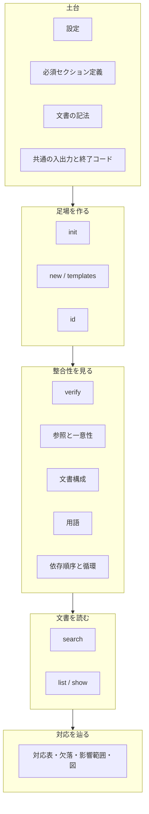

# 基本設計: mdtrace

本書は、利用者から観測できる約束を定める。
コマンドが何を受け取り何を返すか、どんな入力をどう判定するか、
どんなときに何番で終わるか——外から見て確かめられることだけを書く。

内部の作りは詳細設計が、操作の手引きはリファレンスが受け持つ。
本書に書いたことは、実装を入れ替えても変わらない約束である。

### 本書の位置づけ

本書はアーキテクチャ設計を受け、詳細設計へ渡す。各項目の冒頭で、
その項目が具体化する設計判断の識別子に言及する。

### 設計の読み方

各項目は次の 3 節で構成する。

| 節 | 書く内容 |
|---|---|
| 機能概要 | 利用者にとって何ができるようになるか |
| 入出力 | 入力と出力、形式、終了状態 |
| 振る舞い | 判定基準・境界・異常時の扱い |

「振る舞い」が本書の中心である。判定基準を上流に書かないと、
実装が決めた挙動が後から仕様として追認されることになる。

### 機能の全体像



## BD-1: 設定ファイル

ARC-5 が定めた「宣言だけが構成を決める」を、利用者が書く 1 つのファイルとして具体化する。

### 機能概要
どんな文書タイプをどの順に連ね、どのファイルがどの型で、識別子をどう書くかを宣言する。
すべてのサブコマンドがこの 1 つの宣言を共有する。

### 入出力
既定では作業ディレクトリの `mdtrace.yaml`（無ければ `mdtrace.yml`）を読む。
`--config` で明示できる。

```yaml
preset: waterfall                      # new が引く雛形の置き場（組み込みの型を使う場合）
chain: [requirements, design]          # 対応表の段（必須）

files:                                 # 管理対象の文書
  - path: docs/requirements.md         # まとめ指定（docs/requirements/*.md）も書ける
    type: requirements                 # 必須
    id_pattern: "REQ-{seq}"            # 必須
    id_start: 1                        # 連番の開始値
    id_levels: [2, 3]                  # 採番する見出しレベル
  - path: docs/design.md
    type: design
    id_pattern: "BD-{seq}"
    depends_on: [docs/requirements.md] # まとめ指定も書ける

templates:                             # 雛形の差し替え
  requirements: templates/req.md

rules:
  required_sections:
    enabled: true
    config: sections.yaml
```

### 振る舞い
`chain` に載せない文書タイプは、対応表の列にならない。

識別子の書式は `REQ-{seq}` の形と正規表現のどちらでも書ける。
`{seq}` は 1 個までとし、ドットで繋いだ階層は 1 つの識別子として読む。
英字で始まる書式には語句境界を付け、日本語で始まる書式には付けない。
日本語に語句境界を付けると、境界が成立せず 1 件も一致しなくなるためである。

次のいずれかに当たると、検証の不合格ではなく設定の不備として終了コード 2 で止まる。

| 条件 | 理由 |
|---|---|
| `chain` が空 | 対応表がたどる並びを推測しないため |
| `type` が空 | ファイル名から文書タイプを推測しないため |
| `id_pattern` が空 | 文書タイプごとの既定を持たないため |
| `id_pattern` に `{seq}` が 2 個以上 | 展開できないまま黙って 0 件一致になるため |
| `chain` の文書タイプが `files` に無い | 対応表の列が空になるため |
| `path` や `depends_on` の模様（glob）が不正 | 宣言した文書が黙って対象から消えるため |
| `path` や `depends_on` の模様（glob）が設定ファイルの外を指す（`../`・絶対パス） | まとめ指定の展開は設定ファイルの置き場を根に行うため、外を指すと構文が正しくても永遠に一致しない |
| 模様を使わない個別の `path` が 2 つあり、Clean 後の綴りが一致する | どちらの宣言が効くかを決められないため |

判定は展開後ではなく**宣言**に対して行うので、まとめ指定がまだ 1 件も一致しない
初期状態では止まらない。外を指すファイルは模様を使わず個別に宣言すれば従来どおり扱える。

設定ファイルの探索は作業ディレクトリだけを見て、上位へ遡らない。
遡ると、どの設定で動いているかが実行場所によって変わる。
パスの照合は作業ディレクトリ基準と設定ファイル基準の双方で行うので、
同じ設定を指していればどこから実行しても同じ宣言に行き着く。

### 個別宣言とまとめ指定が重なったとき

まとめ指定（`docs/*.md`）で拾った文書を、同じ設定の中で個別の `path` が
型や識別子の書式を変えて指すことがある。例外だけ個別に書き、残りはまとめて
指す使い方を許すため、**模様を使わない個別の宣言は、`files` の中でどちらを
先に書いても、まとめ指定の展開より優先する**。

この優先はまとめ指定と個別指定の間でだけ働く。**Clean 後の綴りが同じ**個別指定が
2 つあるときは順序で決めず、宣言の不備として弾く（上表）。この判定は綴りだけを見る。
まとめ指定どうしが同じファイルに重なったときは、これまでどおり `files` に
先に書いたほうが勝つ。

別名（記号リンク）を介して同じ実体を**綴りの違う**個別指定で 2 つ指した場合は、
宣言としては別物なので上の不備検査には掛からない。実体としては同じ 1 つの文書を
指しているので、まとめ指定の展開と同じ規則で実体へ畳み、`files` に先に書いた
ほうを残す（あとから書いた個別指定は黙って消える）。畳まずに 2 度数えると、
同じ識別子を 2 度読んで「自分自身と重複している」という矛盾した指摘が出る。

## BD-2: 必須セクション定義

ARC-7 が定めた「補助設定の置き場は設定ファイルだけで決める」を具体化する。

### 機能概要
文書タイプごとに、備えるべきセクションの名前と順序を宣言する。

### 入出力
置き場は設定の `rules.required_sections.config` が決める（既定 `sections.yaml`）。

```yaml
requirements:
  required: ["概要", "受け入れ条件", "対象外"]
  order: true
design:            # 連鎖に載る型は定義を持つ。何も求めないなら空でよい
glossary:          # 連鎖外の型は書かなくてもよい
```

この例は BD-1 の設定例（連鎖が requirements → design）と対になる。
連鎖に載る型の定義を欠くと、設定の不備として止まる。

### 振る舞い
`order: true` のとき、存在する必須セクションが宣言順に並んでいるかも見る。

`chain` に載る文書タイプは定義を持たなければならない。何も求めないなら
`required: []` と書く。定義が無いだけで検査対象から外れることはない。
連鎖に載らない文書タイプは、定義が無ければ検査の対象にならない。
節の構成を決めない補助文書のためで、検査したい場合は定義を書く。
検査そのものが要らない場合は `rules.required_sections.enabled: false` にする。

定義ファイルが読めない、または中身が空のときは設定の不備として止まる。
空として続けると、ファイルを消したり綴りを誤ったりした瞬間に検査が素通りする。

## BD-3: 文書の記法

ARC-3 の解析方針と ARC-4 の中核データモデル、ARC-6 の辺の作り方を、
利用者が書く Markdown の決まりとして具体化する。

### 機能概要
本文は自由記述で、形が決まっているのは識別子の置き場と必須セクションだけである。

### 入出力
見出しの**先頭**にあり、その文書の識別子の書式に一致する識別子が「定義」になる。

```markdown
## R-1: ユーザー認証        ← 定義になる
## 認証について（R-1）       ← 定義にならない（先頭ではない）
```

例には、この文書群が使っていない書式（`R-`）を使う。
実際に使っている書式で例を書くと、採番を振り直したときに
コードブロックの中の例だけが取り残される。

見出しのレベルは問わない。名前空間は文書タイプごとに分かれるので、
別の書式を宣言した文書に他方の識別子を書いても定義にはならない。

### 振る舞い
**参照の書き方は 3 通りある。**

| 書き方 | 参照になるか | 使いどころ |
|---|---|---|
| 散文での言及 | なる | 文章の中で自然に触れる場合 |
| 注釈（`<!-- REF: REQ-1 -->`） | なる | 文章に出さずに関係だけ宣言したい場合 |
| 行内コード | ならない | 書式を説明する場合や、関係を持たせずに触れたい場合 |

コードブロックの中も参照にならない。バッククォート・チルダ・4 字下げの
3 形式すべてが対象で、入れ子のフェンスも正しく扱う。

**文脈は読まない。**言及があれば線が引かれ、肯定と否定を区別しない。
線を引きたくない識別子は行内コードで囲む。

**節に属さない参照は辺を作らない。**最初の識別子付き見出しより前（前文）の言及は、
参照整合性と依存順序の検査対象にはなるが、帰属するセクションが無いため
対応表や影響範囲の関係（辺）にはならない。対応に数えたい参照は、
識別子付きセクションの中に書く。

**辺の向きは、どちらの文書に書くかで決まる。**関係は常に下流の文書から書く。
上流の文書に下流の識別子を書くと、依存順序違反として報告される。

**見出しの入れ子も辺になる。**識別子を持つ見出しを入れ子にすると、
親から子へ含有辺が張られる。本文で言及しなくても、構造そのものが関係として読まれる。

**主レベル**は、その文書に実在する識別子のうち最も浅い見出しレベルを指す。
単位は文書タイプではなく文書である。

| 対象 | 主レベルのみ | 深いレベルも含む |
|---|---|---|
| 必須セクションの検査単位 | ✓ | |
| 対応表・欠落の**行** | ✓ | |
| 対応表の**列** | | ✓ |
| 検索・影響範囲・図・索引・本文取得 | | ✓ |

細目に紐づけた対応は、親の行が数える。
親自身に付けた対応は、配下の細目すべてを覆う。行の状態の判定は BD-14 が定める。

**階層識別子は関係を作らず、階層の主張として読む**（ARC-13）。
ドットで繋いだ識別子は上位とは別の 1 つの識別子として認識し、
親子の関係は見出しの入れ子だけが作る。
名前が主張する親子と構造の一致は検証が確かめる（BD-16）。
自動採番はしない。振るのは人で、手書きの階層識別子があっても次の番号は飛ばない。

## BD-4: 構成の生成

ARC-9 が定めた「構成の型を宣言として外に出す」と、ARC-11 の原子的な書き込みを具体化する。

### 機能概要
`mdtrace init` が、構成の型を選んで設定ファイルと必須セクション定義を作る。

### 入出力
構成の型の指定は必須で、既定は無い。文書ディレクトリと出力先を指定できる。
`--config` を付けたときはそれを作り先とみなす。
成功すると 2 つのファイルのパスを表示する。

### 振る舞い
必須セクション定義は、雛形を実際に展開して得た見出しから導く。
雛形を差し替えれば定義も追従し、定義を二重に持たない。

連鎖に載る文書タイプは、雛形が下位の節を持たなくても定義を残す。
雛形を展開できない文書タイプは、定義から落とさず設定の不備になる。
どちらも ARC-9 の「影響」が定めた帰結である。

必須セクションの抽出そのものに失敗した（識別子も H2 も無い雛形で、
見出しが 2 つ以上あるのに 1 件も拾えない）ときは、`required: []` を
書き出したまま警告を添える。書き込みは止めない。

既にあるファイルは `--force` を付けたときだけ上書きする。中身が何であるかは見ない。
`--force` で作り直す先が**いま作り直している設定そのもの**であるときに限り、
構成の型が決めない設定（雛形の差し替え・ルール設定・文書ごとの採番設定）を引き継ぐ。
別の場所へ作るときは引き継がない。無関係な構成の設定が混ざるためである。

次はいずれも設定の不備として、書き込みを始める前に断る。

- `--config` と `-o` が食い違う（作り先は 1 つである）
- 2 つの書き先が同じ実体（別名ごしを含む）を指す
- 出力先の親がディレクトリでない

2 つのファイルは揃って書き換わる。片方が書けなければ、どちらも元のまま残る。

設定へ利用者が書いた YAML のコメントは、作り直すと失われる。
設定は構造として書き戻すためで、文書の書き換えとは扱いが異なる。

## BD-5: 雛形の生成

ARC-9 の構成の型と ARC-5 の「宣言が正典」を具体化する。

### 機能概要
`mdtrace new` が文書タイプごとの雛形を生成し、`mdtrace templates` が
使える雛形の種類を一覧する。

### 入出力
文書タイプを引数に取る。出力先を省くと標準出力へ流す。
参照元の文書を指定すると、その文書の識別子が注釈形式の参照として埋め込まれる。
機能名を渡すと最初のセクションの表題になる。

### 振る舞い
識別子は、同じ書式を共有する既存文書すべてを走査してからその続きを振る。
同じ文書タイプを複数ファイルへ分けても衝突しない。
出力先は丸ごと書き換わるので、そこにある識別子は連番の判断材料にしない。

**識別子の書式は宣言が正典である。**宣言のある文書へ別の書式を指示すると
設定の不備になる。通すと、付けた識別子を検証側が認識しない文書ができる。
書式の指定は、宣言の無い文書のための逃げ道に限る。

書き換えずに結果だけを見られる。その判定は実際に書くときと同じなので、
上書きで失敗することも同じ結果になる。

雛形は設定で差し替えられる。読めないときは設定の不備として止まる。

どの文書タイプを用語集とみなすかは設定が決める（ARC-8）。書き換えると、
`mdtrace templates` が挙げる名前と `mdtrace new` が受け付ける名前も
その設定に従う。組み込みの用語集雛形そのものは 1 つしか無いので、
既存の文書タイプ名と同じ名前を用語集型名に指定した場合は、その文書タイプ
本来の雛形を優先する（用語集への読み替えは最後の手段に限る）。

## BD-6: 識別子の付与

ARC-3 の「書き込みは行単位に限る」と ARC-11 の原子的な書き込みを具体化する。

### 機能概要
`mdtrace id` が、未採番の見出しへ識別子を振る。

### 入出力
対象の文書を引数に取る。付与した行を「ファイル:行番号: 変更後の行」の形で表示し、
最後に件数を出す。既に識別子がある見出しの数も併せて示す。

### 振る舞い
既にある識別子は書き換えず、連番はその続きから振る。
連番は同じ書式を共有する文書全体で 1 本として払い出す。
複数の文書を渡した場合も、書式ごとに 1 本の連番になる。

採番する見出しレベルは宣言または指示で決め、複数のレベルをまとめて対象にできる。
指定が無ければ、文書タイトルを除いた最も浅い見出しレベルを対象にする。
これは BD-3 の**主レベル**（実在する識別子から導く）とは別の判定である。
識別子が 1 つも無い文書にも振れなければならないので、識別子を判断材料にできない。
コードブロック内の見出しに見える行は対象にならない。

対象レベルに合致する見出しが 1 つも無いときは警告を添える。候補はあるが
全て既に識別子を持つとき（付与件数が 0 件）は正常な結果なので警告しない。
どちらも終了コードには影響しない。

参照の目印を、参照を持たないセクションにだけ入れられる。
繰り返し実行しても増えない。

書き込みは全文書の検査を終えてから始める。途中で止まれば 1 つも書き換わっていない。
元の改行コードと見出し形式、利用者が書いたコメントはそのまま残る。

## BD-7: 検証の実行

ARC-7 が定めたルールエンジンの、外から見た振る舞いを定める。

### 機能概要
`mdtrace verify` が、検証ルール 6 種を実行して指摘を集計する。

### 入出力
引数を省くと設定の `files` が対象になる。
形式は人が読む形と機械可読な形の 2 つ。

```json
{
  "errors": [
    {
      "rule": "ref_integrity",
      "kind": "ref_undefined",
      "file": "docs/design.md",
      "line": 44,
      "message": "参照 R-99 は定義されていません",
      "severity": "error"
    }
  ],
  "warnings": [],
  "summary": { "total_errors": 1, "total_warnings": 0, "files": 3 }
}
```

**誤り**が 1 件でもあれば終了コード 1、無ければ 0 を返す。
警告だけなら 0 である。警告も不合格にしたい場合は `--strict` で格上げする。

### 振る舞い
`--rules` で実行するルールを絞れる。設定の `enabled` より優先される。
絞っても他のルールの結果に影響しない。

指摘には深刻度がある。`--strict` はすべての警告をエラーへ格上げする。
既定で警告になるのは、依存宣言の循環・`depends_on` のまとめ指定（glob）の
空一致・必須セクションの順序違反・中身の無いセクション・連番の欠番・
階層識別子の不一致の 6 つである。
これらは「直すべきだが、直っていなくても文書として成立する」ためで、
不合格にする水準を上げたい場合に格上げする。

名指ししたパスが読めないときは設定の不備として止まる。
まとめ指定は一致 0 件でも構わないが、どの引数も 1 件も一致しなければ止まる。
名指しの打ち間違いが「何も起きない成功」になってはならないためである。
別名ごしに同じ文書を 2 度渡しても、1 つとして扱う。

## BD-8: 参照と一意性の判定

ARC-7 が並べたルールのうち、識別子そのものを見る 2 つの判定基準を定める。

### 機能概要
参照された識別子が定義されているか（`ref_integrity`）と、
識別子が重複していないか（`id_uniqueness`）を判定する。

### 入出力
どちらも指摘をファイル名と行番号付きで返す。
未定義の参照と識別子の重複は誤り、連番の欠番は警告とする。

### 振る舞い
定義が見つからない参照を報告する。コードブロックと行内コードに書かれた
使用例は参照として扱わないので、書式の説明が指摘されることはない。

同じ識別子が 2 か所以上で定義されていれば報告する。

連番の欠番は既定では見ない。`check_sequence: true` のとき警告する。
欠番とみなすのは、その文書が実際に使っている最小と最大の間で、
同じ書式を持つどの文書にも現れない番号だけである。

| 構成 | 判定 |
|---|---|
| 1 つの文書に 1, 2, 4 | 3 を欠番として警告 |
| 1, 2 と 3, 4 に分割 | 警告しない（1 本の連番を分けているだけ） |
| 開始番号を 1 と 100 に分けた 2 文書 | 警告しない（番号帯を分けているだけ） |

## BD-9: 文書構成の判定

ARC-7 のルールのうち、ARC-4 の主レベルを検査単位に使うものの判定基準を定める。

### 機能概要
文書タイプごとに定めた必須セクションの有無と順序を判定する。

### 入出力
欠落は誤り、順序違反と中身の無いセクションは警告として返す。

### 振る舞い
識別子付きの見出しがある文書では、**主レベル**のセクションだけを検査し、
その直下の見出しを見る。深いレベルの識別子は主要素の細目とみなす。

順序を見るのは、存在する必須セクションどうしの並びだけである。
欠落しているセクションを順序違反として重ねて報告しない。

中身も下位の見出しも無いセクションは警告になる。
見出しだけ置いて本文を書き忘れた状態を拾う。
これは定義を持つ文書タイプすべてに効く。何も求めない定義でも同じである。

検査の結果は、対象の与え方（全体か 1 ファイルか）で変わらない。
主レベルの単位が文書ごとに決まるためである。

## BD-10: 用語の判定

ARC-8 が定めた「用語集を特別扱いしない」を、判定基準として具体化する。

### 機能概要
用語集が挙げる別表記が、正式な用語の代わりに使われていないかを判定する。

### 入出力
用語集は識別子付きセクションで書く。見出しの表題が用語、本文の第 1 段落が定義になる。

```markdown
## T-1: FR

機能要件 (Functional Requirement)。
```

指摘は誤りとして返す。用語集として扱う文書タイプは
`rules.term_consistency.glossary_type` で変えられる（既定 `glossary`）。

### 振る舞い
定義が「X (Y)」の形なら、X と Y は別表記として扱う。
上の例では、文書に「機能要件」と書くと「正式な用語は FR」と報告される。

照合は語の境界を見る。より長い語の内部への一致（Request の中の Req、
非機能要件の中の機能要件）は使用とみなさない。
前後に同じ字種（英数字・漢字・カタカナ）が続く一致は複合語の一部として見送る。

別表記とみなすのは**言い換えの形をした第 1 文だけ**である。
次のいずれかに当たれば説明文とみなし、別表記を作らない。

- 括弧の後に文が続く
- 括弧より前が 30 文字を超える
- 括弧より前に読点がある
- 別表記が 1 文字しかない
- 別表記そのものが用語として登録済みである

深刻度が誤りなので、取りこぼしより誤検出を避ける側に倒している。

推測は行わない（ARC-8）。用語集の文書自身は走査の対象から外れる。

## BD-11: 依存順序と循環の判定

ARC-7 のルールのうち、ARC-5 が宣言した依存の向きを見るものの判定基準を定める。

### 機能概要
参照が宣言した依存の向きに沿っているかと、依存宣言に循環がないかを判定する。

### 入出力
向きの違反と依存先の不在は誤り、循環と `depends_on` の空一致は警告として返す。

### 振る舞い
`depends_on` に挙げたファイルが存在しなければ報告する。
参照先の識別子が依存関係として宣言されていない文書で定義されていれば報告し、
それが下流の文書であれば「依存順序違反」として区別する。この場合、下流を
`depends_on` に足すよう促さない。依存の向きが逆転し、循環を作ってしまうため。

`depends_on` にまとめ指定（glob）を書いたのに 1 件も一致しなければ警告する。
まとめ指定は展開済みの状態で実在確認にかかるため、綴りを誤って空に展開されると
実在確認をすり抜けて黙って消える。宣言した指定そのものを見て初めて気づける
不備なので、実在確認とは別に見る。宣言時点で 0 件を不備にしない原則（ARC-5）は
崩さないため、誤りではなく警告にとどめる。

次の 3 つは対象外とする。

- 設定の `files` に宣言されていない文書（判定材料が無いため）
- `chain` に載らない文書タイプで**定義された**識別子（どこからでも引かれる補助文書のため）
- 同じ文書タイプの文書どうしの参照（同じ段の中に依存の向きは無い。
  1 つの文書タイプを複数ファイルへ分割しても、兄弟間の参照に宣言を要しない）

連鎖外の文書が持つ**参照**は検査対象である。連鎖外だからといって、
その文書が上流の識別子を無宣言で引いてよいわけではない。

循環は、検証の対象に含まれる文書がその輪に加わっているときに報告する。
始点だけを見ると、輪の一員である文書を単独で検証したときに何も出ない。
輪に加わっていない文書だけを検証したときは報告しない。

## BD-12: 語からの探索

ARC-4 が定めた「本文の行を共有する」を、識別子を知らない読み手の入口として具体化する。

### 機能概要
`mdtrace search` が語を探し、一致を識別子付きの節へまとめて返す。

### 入出力
探すのは本文の行と、識別子を含む見出し行そのものである。
識別子で探せば定義と言及を 1 回で得られる。
一致した行が原文のまま返るので、本文を開かずに読む節を選べる。

```json
{
  "matches": [
    { "id": "R-1", "type": "requirements", "title": "ユーザー認証",
      "file": "docs/requirements.md", "line": 3,
      "hits": [ {"line": 3, "text": "## R-1: ユーザー認証"},
                {"line": 5, "text": "認証は OAuth2 で行う。"} ],
      "hit_count": 2 }
  ],
  "total": 1,
  "truncated": false
}
```

### 振る舞い
検索語は正規表現として解釈する。`--fixed` で文字列そのままとして扱う。
大文字と小文字は区別しない。

一致は**直近の識別子付き見出し**に属する。下位の見出しの中にある一致も、
その節のものとして返る。見出しより前の本文はどの節にも属さないので、
識別子を空にして位置だけ返す。この帰属の規則は参照の帰属と同じである。

コードブロックの中と行内コードは対象にならない。参照や用語の判定と同じ本文の行を
使うので、検索だけが使用例を拾うことはない。
その代わり、コードとして書いたファイル名や関数名はこの検索では引けない。

返す節の数と 1 節あたりの一致行には上限がある。既定は出力が読み手の文脈を
圧迫しない大きさに収めてある。**上限で切っても、絞り込む前の全件数は常に返す。**
切ったことを黙っていると、読み手が「これで全部だ」と誤って判断する。

**一致が無いことは不合格ではない。**終了コードは 0 のままである。

## BD-13: 索引と本文の取り出し

ARC-6 のグラフと ARC-4 の解析結果から、識別子の所在と本文を取り出す約束を定める。

### 機能概要
`mdtrace list` が識別子の索引を、`mdtrace show` が指定した節の本文を返す。

### 入出力
索引は 3 つの形で出せる。関係を含む形、関係を含まないファイルごとの木、
そして機械可読な形である。

```json
{
  "entries": [
    {
      "id": "FR-1",
      "type": "design",
      "title": "認証フロー",
      "file": "docs/design.md",
      "line": 3,
      "end_line": 15,
      "refs": ["R-1"],
      "downstream": ["IMP-1"]
    }
  ],
  "files": ["docs/requirements.md", "docs/design.md"]
}
```

例は架空の構成である。実際の値はこのリポジトリの識別子に依らない。

`refs` はそのセクションが本文で言及している識別子（上流）、
`downstream` はそのセクションが**直接**つながる下流の識別子である。
推移的に辿った先までは含めない。索引を軽く保つためで、
連鎖の先まで辿るのは対応表と影響範囲の役目である。
`downstream` には含有による子も含まれる。

### 振る舞い
木の形は関係を載せないので、識別子が増えても全体を見渡せる大きさに収まる。
どちらも同じ索引から作るので、返る識別子の集合は食い違わない。

本文の取り出しには、その見出しが支配する範囲すべて（下位の見出しを含む）が入る。存在しない識別子を指定すると設定の不備として止まる。
打ち間違いを黙って空の結果にしない。

## BD-14: 対応を辿る出力

ARC-6 のグラフを、網羅の判定と変更前の確認という 2 つの用途へ振り分ける。

### 機能概要
`mdtrace matrix` が起点ごとの対応を表にし、`mdtrace gaps` がそのうち
最終段まで届かない行だけを取り出す。
`mdtrace impact` が指定した識別子から影響が及ぶ範囲を、
`mdtrace graph` が関係そのものを図として返す。

### 入出力
対応表の列は設定の `chain` から作る。段数は 2 段でも 5 段でも同じように出力される。

| 記号 | 状態（機械可読な出力の値） | 意味 |
|---|---|---|
| ✅ | `complete` | すべての経路が連鎖の最終段まで届いている |
| ⚠️ | `partial` | 一部の経路が途中で途切れている |
| ❌ | `missing` | 下流へ辿る経路が 1 本も無い |

記号は人が読む表のためのもので、機械可読な出力には状態の語が載る。
絵文字を機械の契約にすると、消費側が表示の都合の変更で壊れる。

対応表は文書へ貼れる形と機械可読な形で、影響範囲は人が読む形と機械可読な形で出せる。
図は Mermaid の記法で出す。空の一覧は、項目の欠落ではなく空の配列として表現する。

`gaps` は欠落があれば終了コード 1 を返す。他の 3 つは検証の不合格を返さない。
表や図を作ることと、合否を判定することを分けるためである。

### 振る舞い
**同じグラフを見ながら、辿る辺が用途で違う。**

| コマンド | 辿る辺 | 理由 |
|---|---|---|
| `matrix` / `gaps` | 参照のみ | 網羅率に文書の構造が混ざらないようにする。細目を持っているだけで「下流がある」と数えると意味が崩れる |
| `impact` / `graph` | 参照 + 含有 | 「この識別子を変えたら、どこを見直すか」には細目も答えに含まれる |

**段飛ばしは経路として数えない。**起点が最終段を直接参照していても、
途中の段が空ならそこで途切れた経路として扱う。
途中が欠けていること自体が知りたい情報だからである。

影響範囲もこの段を尊重する。下流の段へ進むのは、連鎖上の文書タイプ
どうしを直接参照で辿ったとき（今いる段の 1 つ先まで）だけである。
連鎖外の文書タイプ（用語集・手引きなど）を経由しても段は進まない。
連鎖上の文書タイプから連鎖外を経て別の連鎖上の文書タイプへ入るときは、
経路上で最後に踏んだ段までしか入れず、直接参照が持つ「1 つ先まで」の
猶予は付かない。起点が連鎖外なら、最初に連鎖上の文書タイプへ入るときだけ
無条件で、そこで段が決まる。

同じ段（同じ文書タイプ）どうしの参照は制約なく辿れる。参照そのものは段を
進めないので、そこを経由してから 1 つ先の段へ進むことは妨げない。
`matrix` / `gaps` は起点とその細目から出る直接参照のうち、次の段のものだけを見る。
同じ段の別の識別子を参照で経由した先までは辿らない。したがって対応表が起点を
「下流なし」と判定していても、その識別子を経由した先は影響範囲に含まれうる。

細目を持つ行は、細目ごとに判定して畳む。畳み込みは経路の**すべての段**で効く。
畳まないと、対応表が「下流が無い」と言う一方で影響範囲は同じ下流へ届く、
という食い違いが出る。

起点の段は `--from` で選べる。連鎖の途中から下を見られる。
`matrix` と `graph` は `--filter` で対象を絞れる。
影響範囲は `--depth` で追跡する深さを指定でき、0 なら制限しない。
存在しない識別子や未知の文書タイプを指定すると、設定の不備として止まる。
対応表の絞り込みでは、実在しても起点の段に無い識別子は不備として止まる。
黙って空の表にすると、段の取り違えに気づけない。

図では頂点にも囲みにも連番の名前を割り当て、元の識別子は表示名に載せる（ARC-6）。

## BD-15: 共通の入出力と終了コード

ARC-1 の実行ファイルの構え、ARC-10 の誤りの分類、ARC-11 の書き込みの約束を、
全サブコマンドに共通する契約として定める。

### 機能概要
どのサブコマンドも同じ規則で対象を受け取り、同じ規則で結果を書き出し、
同じ意味の終了コードを返す。

### 入出力
| 終了コード | 意味 |
|---|---|
| 0 | 合格 |
| 1 | 不合格（検証の指摘、対応の欠落） |
| 2 | 設定や引数の不備 |

結果を返すサブコマンドでは、`-o` は成果物をファイルへ残すための指定であり、
省くと標準出力へ流す。`init` の `-o` だけは作り先の指定で、既定を持つ。
空文字を渡すと設定の不備になる。「指定なし」と見分けが付かず、
書き出したつもりの成果物がどこにも残らないためである。

### 振る舞い
**不合格は検証の結果だけとする。**引数・フラグ・設定・入出力の誤りは
すべて設定の不備側に寄せる（ARC-10）。

対象文書の与え方は、対象を受け取るサブコマンドすべてで同じである。

- 引数を省くと設定の `files` が対象になる（`id` だけは対象の明示を求める。
  引数なしで全文書を書き換えると、打ち間違いの被害が大きいため）
- 引数を省いたとき、宣言はあっても実在しないファイルは黙って対象から外れる
- 名指ししたパスが読めないときは設定の不備として止まる
- まとめ指定は一致 0 件でも構わない
- ディレクトリを渡すとその配下の Markdown が対象になる

書き先の判定も全コマンドで同じである。ディレクトリ・名前付きパイプ・装置ファイルは
書き込みを始める前に断る。書き先は一時ファイルを経て置き換えるので、
途中で失敗しても元の内容が残り、元の許可属性を引き継ぐ。
書き先が別名なら指し先の実体を書き換える。

色は端末以外への出力では付かない。ファイルへ書き出すときも付かない。
成果物に制御文字が混ざるためである。
端末へ出すが色は要らない場合は、環境変数で抑制する。
同じ効果の指定をコマンドライン引数で二重に持たない。

## BD-16: 階層識別子の判定

ARC-13 が定めた「名前は主張、関係は入れ子」を、判定基準として具体化する。

### 機能概要
階層識別子の名前上の親が、構造上の親と一致しているかを判定する（`id_hierarchy`）。

### 入出力
指摘はファイル名と行番号付きの警告として返す。`--strict` で誤りへ格上げできる。
検査が要らない場合は `rules.id_hierarchy.enabled: false` にする。

### 振る舞い
名前上の親は、連番の末尾の 1 段を剥がして得る（`R-1.2.3` なら `R-1.2`）。
構造上の親は、その見出しの直近の識別子付き祖先である。
間に識別子の無い見出しが挟まっても透過して辿る（含有辺と同じ規則）。

次のいずれかに当たると警告になる。

| 状態 | 例 |
|---|---|
| 名前上の親と構造上の親が食い違う | `R-2` の配下に `R-1.2` がある |
| 構造上の親が無い | 最上位に `R-9.1` がある |

ドットを含まない識別子は階層を主張していないので、対象にならない。
構造上の子がドットを含まない名前を持つことも違反ではない。
細目のフラットな命名は正しい書き方である。

判定の単位は文書である。親と同じ文書に置かれていない階層識別子は、
構造上の親を持たないため警告になる。子だけを別ファイルへ切り出す構成は、
この検査と両立しないので、使うなら検査を無効化する。

## BD-17: バージョン表示

ARC-14 が定めた「どの経路で導入しても同じ規則で表示する」を、判定基準として具体化する。

### 機能概要
`--version` でバージョン文字列を表示する。

### 入出力
出力は `mdtrace version <文字列>` の 1 行である。

### 振る舞い
表示する文字列は次の優先順位で決める。

| 順 | 源 | 導入経路 |
|---|---|---|
| 1 | ビルド時に ldflags で埋めた値 | リリースバイナリ、`make build` |
| 2 | モジュールバージョン | `go install` |
| 3 | `dev` | ソースを直接 `go build` |

リリースバイナリはタグをそのまま埋めるので `v` 付き（例: `v1.2.3`）になり、
`go install` が埋め込むモジュールバージョンと一致する。
ldflags の「未指定」は空文字で判定する。実在しうるバージョン文字列を
未指定の目印にすると、その値を明示した指定が黙って無視される。
