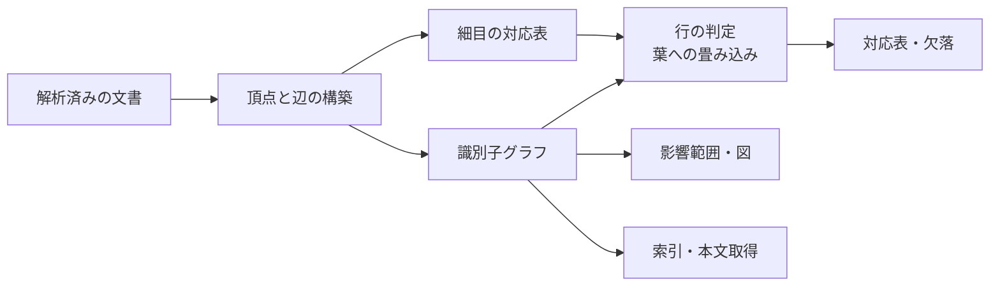

# 詳細設計: mdtrace

本書は、基本設計が約束した振る舞いをどのコードが担うかを定める。
パッケージごとに、担当するファイル・内部の処理・壊しやすい箇所を記す。

パスはコード表記で書く。この記述と実ファイルの対応はテストが双方向で検査するため、
構成を変えたまま本書を放置すると検証が失敗する。

### 本書の位置づけ

本書は基本設計を受け、テスト設計へ渡す。各項目の冒頭で、
その項目が実装する外部仕様の識別子に言及する。

### 設計の読み方

各項目は次の 3 節で構成する。

| 節 | 書く内容 |
|---|---|
| 担当箇所 | 担当するファイル・パッケージ |
| 処理 | 内部の構造と処理の流れ |
| 留意点 | 保たなければならない条件と、壊しやすい箇所 |

「留意点」は、読んだだけでは気づけない制約を残すための節である。
ここに書いていないことは、コードを読めば分かることに限る。

### 読む順序

初見でコードを追う場合、この順に読むと全体像が掴める。

| 順 | 場所 | 見えるもの |
|----|------|-----------|
| 1 | `internal/parser/document.go` | 文書 → 見出し・識別子・参照・本文の行という中核データモデル |
| 2 | `internal/config/config.go` | 全コマンド共通の設定、連鎖、識別子の書式、宣言の検証 |
| 3 | `internal/graph/graph.go` | 識別子グラフと辺の種別 |
| 4 | `pkg/trace/build.go` → `pkg/trace/matrix.go` | グラフの構築と、段数に依らない対応表 |
| 5 | `pkg/verify/verify.go` → `internal/rules` | 検証エンジンとルール |
| 6 | `pkg/scaffold` | 文書生成と採番（利用者の文書を書き換える唯一の層） |

### 構成の見取り図

ディレクトリから「これはどこの話か」を引きたいときの索引。内容は各 DD-N にある。

```
cmd/mdtrace/      サブコマンドの定義（DD-15）
internal/parser/  文書の解析（DD-1）
internal/config/  設定の読み込みと展開（DD-2）
internal/graph/   識別子グラフ（DD-3）
internal/rules/   検証ルール（DD-4）
internal/terms/   用語集の読み取り（DD-5）
internal/fileio/  原子的な書き込み（DD-6）
internal/cli/     コマンド共通の入口（DD-7）
pkg/scaffold/     雛形の生成と識別子の採番（DD-8, DD-9）
pkg/verify/       検証エンジンと出力（DD-10）
pkg/trace/        構築・対応表・欠落・影響範囲・索引・検索（DD-11〜DD-13）
templates/        雛形と構成の型の埋め込み（DD-14）
```

## DD-1: 文書の解析

BD-3 の記法を読み取る層。すべてのコマンドの入力がここから出る。

### 担当箇所
`internal/parser/document.go` と `internal/parser/ast.go`。

### 処理
構文木を 1 度だけ作り、そこから 4 つを取り出す。

- 見出し（レベル・行番号・識別子・表題・支配範囲・本文の有無）
- コードの範囲（フェンス・字下げ・行内コード）
- 本文の行（コードブロックを除き、行内のコード表記を空白へ潰したもの）
- 行と、その行を終える改行コード

参照だけは構文木ではなく原文への正規表現で拾い、コードの範囲を除外する。
注釈形式の参照は構文木では本文として扱われないためである。
拾った参照は、その位置を含む直近の識別子付き見出しへ紐づける。

見出しの親子関係は、レベルの深さを積み上げて組み立てる。

### 留意点
**本文の行は解析のときに 1 度だけ求め、解析結果へ持たせる。**
呼ばれるたびに算出すると、同じ文書に構文解析が二重に掛かる。
用語の照合と本文の検索は、この 1 つの結果を読むだけにする。

行内のコード表記は取り除くのではなく**空白で潰す**。長さを変えると行番号がずれる。

改行コードは行ごとに覚える。1 つに正規化すると、改行が混在する文書を
書き換えたときに触っていない行まで差分に出る。
新しい行を足すときに使う改行は最初の行末だけで決める。
1 か所でも CRLF があれば CRLF と決めると、コードブロックに CRLF の例を
1 行書いた文書が丸ごと書き換わる。

見出しの下線形式（setext）の下線は見出しの一部なので、
本文の有無を数えるときには除く。本文の行そのものには残る。

## DD-2: 設定の読み込みと展開

BD-1 の設定ファイルを読み、宣言と実体を分けて保持する。

### 担当箇所
`internal/config/config.go`（探索・読み込み・検証・パス解決・展開）、
`internal/config/idpattern.go`（識別子の書式の文法。`*Config` に依存しない）、
`internal/config/strictyaml.go`（YAML の厳密な読み取り。mdtrace 固有の知識を持たない）。

### 処理
設定の探索・読み込み・宣言の検証、相対パスの解決、
識別子の書式から正規表現への変換、連番の抽出、
階層識別子の名前上の親の算出、ファイル依存グラフの生成を持つ。

**宣言と実体を分けて保持する**（ARC-5）。宣言はまとめ指定を含んだ利用者の記述そのもので、
実体はそれを実ファイルへ広げた一覧である。展開は読み込みのときに 1 度だけ行う。

規則ごとに構造が違う設定は、木のまま保持して各コマンドが自分の分だけ展開する。

### 留意点
連番の抽出は 1 か所に集約する。接頭辞を除いた**先頭**の数字を取るので、
階層識別子からは最上位の番号が出る。採番と欠番判定が同じ規則を共有する。
名前上の親の算出も同じ場所に置き、階層識別子の読み方が抽出と分かれないようにする。

作業ディレクトリ基準で解決した結果が設定ディレクトリの外を指す場合は、
設定基準の指定とみなす。この 2 段構えが、どこから実行しても同じ宣言に
行き着くことの実装である。宣言と文書の結び付けは実体でも照合するので、
別名ごしの綴りでも同じ宣言を引ける。

個別宣言どうしの重複検査（Validate）と展開時の重複デデュープ（Refresh）は
見ているものが違う。前者は綴り（Clean 後の文字列）の一致、後者は実体
（`EvalSymlinks` で解決したパス）の一致で判定する。前者を実体で判定すると、
まだ 1 件も一致しない glob と同じく「展開してみないと分からない」不備になり、
ARC-5 が定めた「宣言そのものに対して判定する」から外れる。

## DD-3: 識別子グラフ

BD-14 の 4 つの出力が共有する、唯一のグラフ表現。

### 担当箇所
`internal/graph/graph.go` と `internal/graph/mermaid.go`。

### 処理
外部のグラフ実装へ隣接の保持・幅優先探索・基本閉路の列挙を委譲し、
文字列の識別子と内部の番号との対応付けだけを内側に持つ。

辺の種別は「両端の組」から引く写像で持つ。
辺の追加が多重辺を弾いているので、1 組につき 1 種別で足りる。

図の出力は外部の実装に頼らず、記法を直接組み立てる。

### 留意点
**循環の列挙は辺の種別を見ない。**含有辺を含むグラフを渡すと文書の構造が
循環として出るので、渡してよいのは参照辺だけのグラフに限る。
現在の唯一の呼び出しはファイル依存グラフで、そこには参照辺しか無い。

到達可能集合も辺の種別を問わない。絞りたい側が呼び分ける。

図の頂点と囲みへ割り当てる連番の名前は生成順に振る。
表示名との対応はここでしか持たないので、順序が変わると図の同一性が崩れる。

## DD-4: 検証ルール

BD-8・BD-9・BD-10・BD-11・BD-16 の判定基準を、ルールごとの関数として実装する。

### 担当箇所
`internal/rules` 配下。共通の枠組みが `internal/rules/rules.go`、
判定が `internal/rules/ref_integrity.go`、`internal/rules/id_uniqueness.go`、
`internal/rules/required_sections.go`、`internal/rules/term_consistency.go`、
`internal/rules/dep_order.go`、`internal/rules/id_hierarchy.go`。

### 処理
各ルールは解析済みの文脈を受け取り、指摘の一覧を返す。
文脈は設定・解析済みの文書・必須セクション定義・規則設定と、
識別子から定義を引く索引を持つ。

指摘はルール名・ファイル・行番号・本文・期待値・深刻度で構成する。
並びはファイルと行番号で整える。

### 留意点
**定義の索引は文脈の生成時に作る。**呼び出し側が別の手順で用意する形にすると、
呼び忘れたときに参照整合性が全参照を「未定義」と報告する。

`dep_order` だけがファイルシステムを読む。それ以外のルールは解析結果と設定だけを見る。
内訳は次のとおりで、いずれも宣言が指す先の状態は解析結果に現れないため、
判定のたびにその場で確かめる必要がある。

- 依存先ファイルの実在確認（`os.Stat`）。宣言先が消えていることは解析結果に現れない
- depends_on のまとめ指定（glob）の展開（`Config.Expand`）。何にも一致しない指定を
  警告するには、宣言と展開結果を突き合わせる必要がある
- まとめ指定の展開結果と個別宣言の記号リンク解決（`Config.ClaimedPaths` /
  `Config.PathKey`）。展開結果の中に別の個別宣言が指す実体と同じファイルが
  含まれることがあり、そのパスの実効宣言（どちらの宣言に属するか）を
  判定するには記号リンクを解決した実体で比較する必要がある

依存先の実在確認と glob 空一致の警告は、どちらも**検証対象の文書についてだけ**見る。
対象外のファイルまで指摘すると、指摘とファイルの対応が読めなくなる。

`Issue.File` の綴りはルールによって基準が違う。実在エラー・循環・glob 空一致の
警告は**宣言の綴り**（`files` に書いた path）で報告する。cross-file の参照
整合性エラーは**渡された綴り**（コマンドライン引数や記号リンク経由の綴り）で
報告する。前者は宣言そのものの不備を指すため宣言の綴りに、後者は利用者が
指定した文書を指すため渡された綴りにそろえている。

循環の報告は、報告するファイルから始まる並びへ回してから出す。
指摘の位置と本文の先頭が食い違うと、どこから読めばよいか分からない。

別表記の判定条件は意図的に狭めてある。一般化すると説明文から誤った別表記を作る。
条件を緩める変更は、深刻度を下げる判断とセットでなければならない。

## DD-5: 用語集の読み取り

BD-10 の用語集を、1 つの文書タイプとして読む。

### 担当箇所
`internal/terms/set.go`。

### 処理
解析済みの文書群と用語集の文書タイプを受け取り、用語の集合を返す。
見出しの表題を用語、セクション本文の第 1 段落を定義として読む。
用語の照会・用語集の文書かの判定・別表記の取り出し・
指定した語を含む行の探索を提供する。

### 留意点
探す行は解析結果が返す本文の行を使う。独自に走査すると、
用語の判定だけが使用例を拾う。

## DD-6: 原子的な書き込み

BD-15 が全コマンドへ課した書き込みの約束を、1 か所で実装する。

### 担当箇所
`internal/fileio/fileio.go`。

### 処理
書き先の検査、一時ファイルを経た置き換え、複数ファイルのまとめ書きを持つ。
書き先が別名なら指し先の実体を解決してから書く。
元の許可属性は引き継ぐ。

### 留意点
**検査はすべて書き込みより先に行う。**この順序がこのパッケージの存在理由で、
呼び出し側が個別に書くと約束が崩れる。

出力先のディレクトリは必要なら作る。書き込みに失敗しても
作ったディレクトリは残るので、保証するのはファイルの内容だけである。

## DD-7: コマンド共通の入口

BD-15 の対象の与え方・書き先・終了コードを、全サブコマンドで共有する。

### 担当箇所
`internal/cli/cli.go`。

### 処理
設定の読み込み、対象文書の展開、書き先の検査、出力先の切り替え、
終了コードの決定、形式名の正規化と機械可読な書き出しを提供する。

対象の展開は 4 つの規則を持つ。引数が無ければ設定の宣言、
名指しは読めなければ失敗、まとめ指定は 0 件でも許す、
ディレクトリは配下の Markdown を集める。展開後は同じ実体を 1 つにまとめる。

### 留意点
終了コードの決定は**既定を不備側に置く**。分類し忘れた誤りが
合格として通ることがない。

同じ実体の判定は記号リンクを解決してから行う。
綴り違いの同じファイルを 2 度検証すると、指摘も 2 度出る。

対象の既定解決（引数が空なら設定の `files`）はここに 1 か所だけ持つ。
`verify.Run`（DD-10）と `trace.Build`（DD-11）は paths が呼び出し側で
解決済みであることを契約とし、空で呼ばれた場合は既定解決を行わずに
誤りとして返す。コマンド層は必ずこの関数を経由してから両者を呼ぶ。

## DD-8: 雛形の生成と構成の生成

BD-4 の構成の生成と BD-5 の雛形の生成を担う。

### 担当箇所
`pkg/scaffold/template.go` と `pkg/scaffold/init.go`。
雛形と構成の型の宣言は `templates` 配下に置く。

### 処理
雛形の生成は、文書タイプ・出力先・参照元・機能名・開始番号を受け取り本文を返す。
出力先が指定されていればファイルへも書き出す。
連番が「同じ書式を持つ文書すべて」を走査して決まるため、
次の生成が前の結果を見られる必要がある。

構成の生成は、構成の型の宣言を設定へ展開し、必須セクション定義を
**雛形を実際に展開して解析した見出し**から導き、書くべき 2 つのファイルの中身を返す。
書き出しそのものは呼び出し側が行う。

### 留意点
引き継ぎは必須セクションを導く**前**に済ませる。
後で行うと、雛形の差し替えが定義へ反映されない。

雛形を展開できない文書タイプは、定義から落とさず誤りとして返す（BD-4）。
ここで握り潰すと、呼び出し側には成功として見える。

組み込みの用語集雛形の実体名は `templates` パッケージの都合で常に
`tmpl.GlossaryName`（`"glossary"`、DD-14）。一覧表示（`TemplateNames`）と
読み込み（`loadTemplate`）は、実体名で直接引ける場合はそちらを優先し、
`Config.GlossaryType()`（既定 `glossary`）と一致する名前で実体名としては
引けないときだけ読み替える。優先順位を逆にすると、`glossary_type` に
既存の文書タイプ名を指定した設定で、その文書タイプ本来の雛形が
黙って用語集にすり替わる。

宣言（`Files`）の探索（`declForType`）も同じ理由で、要求した名前が
`Config.GlossaryType()` と一致し宣言が無いときだけ実体名でも探す。
`mdtrace init --force` は `rules`（`glossary_type` を含む）を引き継ぎ、
`Files` はプリセット既定（実体名）へ戻すため、設定内で名前が一時的に
食い違う状態を通り抜けられる必要がある。

書き換えずに結果だけを見る場合も、出力先から決まる採番と上書きの判断は同じものを使う。

## DD-9: 識別子の採番

BD-6 の付与を、行単位の書き換えとして実装する。

### 担当箇所
`pkg/scaffold/id.go` と `pkg/scaffold/seq.go`。

### 処理
連番の払い出しと行の書き換えを分けて持つ。
払い出しは同じ書式を共有する文書全体を走査して次の番号を決める。
書き換えは解析結果が示した行だけを対象とし、見出しの記号と表題の間へ識別子を挿む。

参照の目印は見出し全体の後ろへ入れ、既に入っていれば重ねない。

### 留意点
連番の判定は、接頭辞を除いた先頭の数字だけを見る（DD-2 の抽出規則）。

払い出しと書き換えを分けて持つのは、書き込みより先にすべての検査を
終えるためである。混ぜると、検査の途中で書き始めることになる。

## DD-10: 検証エンジンと出力

BD-7 の実行と集計、BD-2 の定義の読み込みを担う。

### 担当箇所
`pkg/verify/verify.go` と `pkg/verify/output.go`。

### 処理
設定と対象文書と実行条件を受け取り、ルールを選び、実行し、集計する。
必須セクション定義の置き場は設定だけが決める。
出力は人が読む形と機械可読な形へ整形する。

### 留意点
**補助設定が読めない・空である・連鎖に載る文書タイプの定義を欠く場合は、
合格ではなく設定の不備として扱う。**定義が無いほうが検査を素通りする逆転を避ける。

規則設定を読み取る型は 1 つに保つ。2 つ持つと、項目を足したときに片方だけ直す事故が起きる。

深刻度の格上げは集計の直前に行う。ルール側に持たせると、
絞り込んで実行したときに格上げの有無が変わる。

paths は呼び出し側で解決済みであることが契約。空で呼ぶと既定解決を
行わずに誤りを返す（既定解決そのものは DD-7 の `ExpandTargets` が担う）。

## DD-11: グラフの構築と行の判定

BD-3 の主レベルと、BD-14 が定めた細目の畳み込みを、対応表の入力として組み立てる。

### 担当箇所
`pkg/trace/build.go` と `pkg/trace/rows.go`。

### 処理
解析済みの文書から頂点を作り、本文の参照から参照辺を、
識別子付き見出しの入れ子から含有辺を張る。
このとき見出しの木を 1 度だけ歩き、識別子ごとの直下の細目も同時に記録する。

行の判定の単位は**葉**（それ以上細目を持たない識別子）に置く。
親に付けた対応は配下の葉すべてを覆い、細目に付けた対応はその細目だけを覆う。



### 留意点
**含有の関係はグラフの辺から引けない。**同じ組に参照辺が重なると
種別が上書きされるので、見出しの木から取る。

定義の無い識別子への参照では辺を作らない（ARC-6）。
グラフの構築側で弾くので、報告するのは検証ルールの役目になる。

paths は呼び出し側で解決済みであることが契約。空で呼ぶと既定解決を
行わずに誤りを返す（既定解決そのものは DD-7 の `ExpandTargets` が担う）。

細目が覆われたかの判定には**自分自身の下流だけ**を見る。
畳んだ下流で判定すると、対応の無い細目まで覆われたことになる。

畳み込みは経路の**すべての段**で行う。起点でだけ畳むと、
同じ識別子が「起点なら届いている／経路の途中なら届いていない」と割れる。

## DD-12: 対応表・欠落・影響範囲・図

BD-14 の 4 つの出力を組み立てる。

### 担当箇所
`pkg/trace/matrix.go`、`pkg/trace/gaps.go`、`pkg/trace/impact.go`、`pkg/trace/graph.go`。

### 処理
対応表は連鎖に沿った**経路の一覧**を行ごとに持つ。
段ごとの値ではなく経路として持つので、段数が変わっても構造が変わらない。
経路長は連鎖の段数で頭打ちになるので、分岐が多くても発散しない。

欠落は対応表の射影として作る。同じ判定を共有するので、
対応表が完了と言う行を欠落が未達と数えることがない。

影響範囲は距離付きの到達可能集合として求め、距離 1 とそれ以降で分ける。

### 留意点
**空の一覧は構築時に空の配列で初期化する。**整形時に詰めると、
整形が受け手を書き換えることになり、2 度呼ぶと中身が変わる。

段のラベルは連鎖から取る。書き写すと、特定の進め方の語彙が出力に埋め込まれる。

経路は起点を含めずに持つ。含めると、段の添字と経路の添字が 1 つずれる。

## DD-13: 索引・本文の取り出し・検索

BD-12 の探索と BD-13 の索引を組み立てる。

### 担当箇所
`pkg/trace/index.go` と `pkg/trace/search.go`。
形式名の正規化と機械可読な書き出しは、共通の入口（DD-7）のものを使う。

### 処理
索引は解析結果から識別子の所在と参照関係を集める。
関係を含む形と、ファイルごとに識別子と表題だけを並べた木の形を、同じ索引から作る。
本文の取り出しは、解析結果が持つ支配範囲の行をそのまま切り出す。

検索は解析結果の本文の行と、識別子を含む見出し行そのものを走査し、
一致を識別子付きの節へまとめる。帰属は参照の紐付けと同じ関数を共有する。

### 留意点
上限で切る処理は、総数を数え終えてから行う。先に切ると総数が失われる。

機械可読な書き出しは 1 か所に集約する。5 か所に写しを持つと、
字下げや末尾の改行が片方だけずれる。

## DD-14: 雛形と構成の型の埋め込み

BD-4 と BD-5 が読む雛形の置き場を定める。

### 担当箇所
`templates/embed.go` と、同じディレクトリの構成の型ごとのディレクトリ。

### 処理
構成の型の宣言（連鎖・ファイル構成・識別子の書式）と、
各文書の書き出しを担う Markdown を実行ファイルへ埋め込む。
型の一覧はディレクトリの走査から、雛形の一覧はファイルの走査から得る。

用語集の雛形は型に依らないので、どの型からも同じものを返す。

### 留意点
**一覧を Go コードに書かない。**書くと、型や雛形を足したときに
一覧だけが取り残される。

構成の定義は宣言だけが持つ。生成の手続きに同じ構成を書かない。

## DD-15: サブコマンドの定義

BD-15 が定めた共通の契約に沿って、各コマンドの入口を組み立てる。

### 担当箇所
`cmd/mdtrace/root.go` がすべてのサブコマンドを束ね、
`cmd/mdtrace/main.go` が終了コードを返す。個々の定義は次のとおり。

| ファイル | 定義するサブコマンド |
|---|---|
| `cmd/mdtrace/init.go` | `mdtrace init` |
| `cmd/mdtrace/new.go` | `mdtrace new`、`mdtrace templates` |
| `cmd/mdtrace/id.go` | `mdtrace id` |
| `cmd/mdtrace/verify.go` | `mdtrace verify` |
| `cmd/mdtrace/search.go` | `mdtrace search` |
| `cmd/mdtrace/trace.go` | `mdtrace list`、`mdtrace show`、`mdtrace matrix`、`mdtrace gaps`、`mdtrace impact`、`mdtrace graph` |

### 処理
各コマンドはフラグの受け取り、対象の展開、下位の層への委譲、
結果の表示、終了コードへの変換だけを担う。

利用者から見た関心の分類は根の説明文が持ち、そこが正典になる。

### 留意点
**処理を持たない。**持つと、同じ判断がサブコマンドごとに書き分けられる。
例外はフラグどうしの整合の検査で、これはフラグを定義した層でしか判断できない。
`graph` の `--filter` は、グラフ出力が未知の識別子を黙って空の部分グラフに
するため、手前で下位の検査（対応追跡の層）を呼び出して断る。判定は下位が持ち、
ここは設定エラーへの変換だけを行う。`matrix` は自身の検証が案内を出すので呼ばない。

出力はコマンドの出力先を経由する。標準出力へ直接書くと、
書き先を切り替えたときに結果が分かれる。

色の抑制は出力の組み立てより前に決める。
