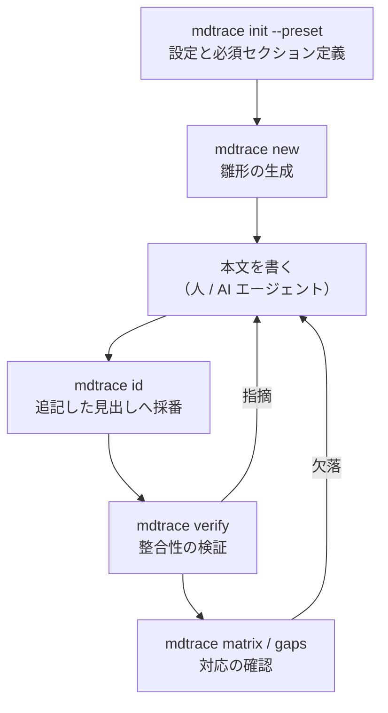
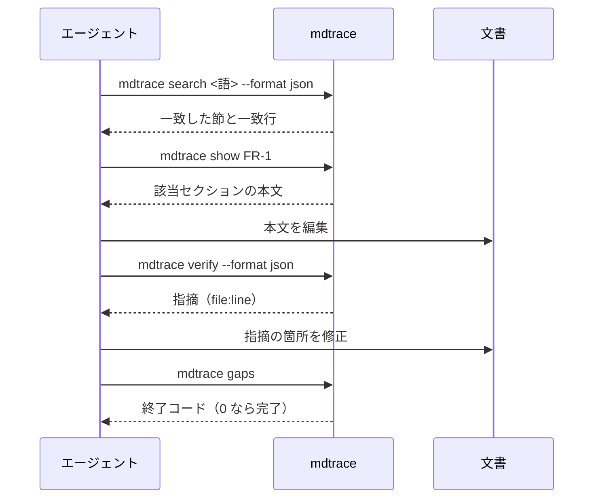

# mdtrace リファレンス

利用者向けの操作手引きです。何をどの順に実行するか、どのフラグが何をするか、
指摘が出たときに何を直すかを扱います。

**判定の基準そのものは [基本設計](basic-design.md) にあります。**
本書は「どう使うか」、基本設計は「何を約束しているか」を書きます。
迷ったら基本設計を正典としてください。

はじめて触れる場合は [README](../README.md) を先に読んでください。

## GUIDE-1: 使いはじめる

BD-4 の構成の生成から、最初の検証までを一巡します。

```bash
mdtrace init --preset waterfall     # mdtrace.yaml と sections.yaml
mdtrace new requirements -o docs/requirements.md --feature "ユーザー認証"
# 本文を書く（人と AI の担当範囲）
mdtrace id docs/requirements.md     # 追記した見出しへ採番
mdtrace verify 'docs/**/*.md'       # 整合性を見る
mdtrace gaps                        # 下流へ辿り切れない識別子
```

`mdtrace init` は構成の型（プリセット）から設定と必須セクション定義を作ります。
既定は無いので必ず選んでください。選べる型は `mdtrace init --help` に出ます。
設定ができたあとは `mdtrace templates` で、その構成で使える雛形の種類を一覧できます
（設定を読むので `init` より前には動きません）。

組み込みのプリセットは 1 つで、`waterfall` という名前です。
要件定義 → アーキテクチャ設計 → 基本設計 → 詳細設計 → テスト設計 の 5 段に、
連鎖外のリファレンスと用語集が付きます。

**連鎖の段数も文書タイプの名前も設定で決まります。**
規制条項 → 手順 → 証跡、テスト観点 → ケース → 自動化、
決定記録 → 影響を受ける設計 → 実装 といった構成も、`mdtrace.yaml` を書けば同じように扱えます。
構成の型は出発点にすぎません。

## GUIDE-2: 文書の書き方

BD-3 が定めた記法を、書き手の手順として示します。

本文は自由記述です。形が決まっているのは次の 3 点だけです。

| 決まっている点 | 例 |
|---|---|
| 見出しの先頭に識別子を置く | `## R-1: ユーザー認証` |
| 文書タイプごとの必須セクションを備える | `### 概要` `### 受け入れ条件` `### 対象外` |
| 識別子の表記を揃える | `R-1`（設定の `id_pattern` に従う） |

以降の例では `R-` `FR-` `IMP-` を使います。実際に使っている書式で例を書くと、
採番を振り直したときにコードブロックの中の例だけが取り残されるためです。

### 参照の 3 つの書き方

```markdown
## FR-1: 認証フロー

R-1 を実現する。                    ← ① 散文で言及する（参照になる）

<!-- REF: R-2 -->                   ← ② 注釈で明示する（参照になる）

なお `R-3` は本設計の対象外とする。   ← ③ 行内コードで囲む（参照にならない）
```

| 書き方 | 使いどころ |
|---|---|
| 散文での言及 | 文章の中で自然に触れる場合 |
| `<!-- REF: R-1 -->` | 文章に出さずに関係だけ宣言したい場合。雛形生成や `mdtrace id --refs` が置くのもこの形 |
| 行内コード | 識別子の書式を説明する場合や、関係を持たせずに触れたい場合 |

**文脈は読まれません。**「なお R-2 は対象外とする」と書いても線は引かれます。
線を引きたくない識別子は行内コードで囲んでください。

### 参照の向き

辺の向きは上流から下流です。**どちらの文書に書くかで向きが決まります。**


要件文書に `IMP-1` と書くと逆向きの辺になり、依存順序違反として報告されます。
関係は常に下流の文書から書いてください。

### 見出しの入れ子

識別子を持つ見出しを入れ子にすると、親から子へ辺が張られます。

```markdown
## R-1: ユーザー認証

### R-1.1: パスワード認証     ← R-1 → R-1.1 の含有辺
```

`R-1.1` は `R-1` とは別の 1 つの識別子として読まれます。
ドットの後に数字が続くときだけ階層とみなすので、
文末の「詳細は R-1。」「See R-1. Next」は `R-1` への参照として正しく読まれます。

親子の関係を作るのはあくまで**見出しの入れ子**で、ドットは階層の主張にすぎません。
主張と構造が食い違うと（`R-2` の配下に `R-1.1` を書くと）、
検証ルール `id_hierarchy` が警告します。

**階層識別子は自動採番しません。**振るのは人で、連番の判定は最上位だけを見ます。

意図しない線が無いかは索引で確認できます。

```bash
mdtrace list --format json
```

## GUIDE-3: 一連の流れ



上流を `--based-on` で指定すると、参照が雛形に埋め込まれます。

```bash
mdtrace new architecture -o docs/architecture.md --based-on docs/requirements.md
```

```markdown
## FR-1: <!-- TODO: 機能名 -->

<!-- REF: R-1 -->
<!-- REF: R-2 -->
```

不要な参照は消し、必要な参照を残す形で本文を書きます。
参照が無いセクションに目印を入れたい場合は次のようにします。

```bash
mdtrace id docs/architecture.md --refs "R-*"
```

参照を持たないセクションにだけ目印が入ります。繰り返し実行しても増えません。

変更するときは、影響範囲を先に見ます。

```bash
mdtrace impact R-1 --depth 2
```

```
影響範囲: R-1

直接の影響（1 次）:
  - FR-1: 認証フロー (docs/design.md:3)
  - FR-2: トークン更新 (docs/design.md:16)

間接の影響（2 次以降）:
  - IMP-1: 認証パッケージ (docs/implementation.md:3)

合計: 直接 2 件, 間接 1 件
```

## GUIDE-4: 足場を作るコマンド

BD-4 の構成の生成、BD-5 の雛形の生成、BD-6 の識別子の付与に対応します。

| コマンド | 主なフラグ | 動作 |
|---|---|---|
| `init` | `--preset`（必須）, `-o`, `--docs-dir`, `--force` | 構成の型から設定と必須セクション定義を作る |
| `new <type>` | `-o`, `--based-on`, `--feature`, `--pattern`, `--start`, `--force`, `--dry-run` | 雛形を生成する。`-o` 省略時は標準出力 |
| `templates` | — | 使える雛形の種類を表示する |
| `id <files...>` | `--pattern`, `--refs`, `--level`, `--start`, `--dry-run` | 見出しへ識別子を付ける。既存の識別子は保つ |

- `--docs-dir` は文書ディレクトリを変えるときに使います（既定 `docs`）
- `--level 2,3` で複数のレベルをまとめて採番できます
- `--start` は連番の開始値です。0 なら同じ書式の既存文書の続きから振ります
- `--dry-run` は書き換えずに結果だけを表示します。判定は実際に書くときと同じです
- 必須セクション定義の置き場は `rules.required_sections.config` が決めます（既定 `sections.yaml`）
- `-o` を省いた `init` は `--config` の指定先、無ければ `mdtrace.yaml` に作ります

`--pattern` は設定に宣言の無い文書のための指定です。
宣言のある文書へ別の書式を渡すと設定の不備になります（BD-5）。

どの文書タイプを用語集とみなすかは `rules.term_consistency.glossary_type`
（既定 `glossary`）が決めます（GUIDE-8）。書き換えると `templates` が
挙げる名前と `new <type>` が受け付ける名前もそれに従います（BD-5）。

`--force` で同じ設定ファイルを作り直すときは、構成の型が決めない設定
（`templates:`、`rules:`、文書ごとの `id_start` と `id_levels`）を引き継ぎます。
`-o` で別の場所へ作るときは引き継ぎません（BD-4）。

設定へ書いた YAML のコメントは、作り直すと失われます。

## GUIDE-5: 整合性を見るコマンド

BD-7 の実行と、BD-8 から BD-11 までの判定基準に対応します。

```bash
mdtrace verify [files...] [--rules 名前,名前] [--strict]
               [--format text|json] [-o パス]
```

- 引数を省くと設定の `files` が対象になります
- `--rules` で実行するルールを絞れます（設定の `enabled` より優先されます）
- `--strict` はすべての警告をエラーに格上げします

**誤りが 1 件でもあれば終了コード 1、警告だけなら 0 です。**
警告になるのは、依存宣言の循環・`depends_on` のまとめ指定（glob）が
1 件にも一致しないこと・必須セクションの順序違反・中身の無いセクション・
連番の欠番・階層識別子の不一致です。これらも止めたいときは `--strict` を付けます。

| ルール | 見るもの | 直し方 |
|---|---|---|
| `ref_integrity` | 参照された識別子が定義されているか | 綴りを直すか、定義を書く |
| `id_uniqueness` | 識別子の重複と連番の欠番 | 重複を解消する。欠番は番号帯を分けたなら無視してよい |
| `required_sections` | 必須セクションの有無・順序、空のセクション | 見出しを足す。並べ替える。本文を書く |
| `term_consistency` | 用語集の別表記が正式な用語の代わりに使われていないか | 正式な用語へ書き換える |
| `dep_order` | 参照の向きと、依存宣言の循環・空一致 | 参照を下流の文書から書くか `depends_on` を見直す。下流を `depends_on` に足すと循環を作るので勧めない。まとめ指定の綴りも確かめる |
| `id_hierarchy` | 階層識別子の名前上の親と構造上の親の一致 | 見出しを名前上の親の配下へ移すか、識別子を付け直す |

判定の細かい境界（欠番とみなす範囲、別表記とみなす条件）は BD-8 から BD-11 と
BD-16 に、主レベルの導き方は BD-3 にあります。

用語集は識別子付きセクションで書きます。専用の書式も専用のコマンドもありません。

```markdown
## T-1: FR

機能要件 (Functional Requirement)。
```

定義が「正式な語 (別表記)」の形なら、別表記が本文で使われたときに指摘されます。
用語の追加は見出しを書いて `mdtrace id` で採番するだけです。

## GUIDE-6: 文書を読むコマンド

BD-12 の探索と BD-13 の索引に対応します。識別子を知らない状態から読む節を決めるための 3 つです。

```bash
mdtrace search <pattern> [files...] [--type T] [--limit N] [--hits N] [--fixed]
                         [--format text|json] [-o パス]
mdtrace list  [files...] [--type 文書タイプ] [--format text|tree|json] [-o パス]
mdtrace show  <ID> [files...] [-o パス]
```

| コマンド | 使う場面 |
|---|---|
| `search` | 目的の語はあるが識別子を知らない。一致行が返るので、本文を開かずに読む節を選べる |
| `list --format tree` | 全体を見渡したい。関係を載せないので `--format json` よりずっと小さい |
| `show <ID>` | 読む節が決まった。下位の見出しを含めて本文を取り出す |

- `--type` は文書タイプで絞ります
- `--limit` は返す節の上限、`--hits` は 1 節あたりに見せる一致行の上限です
- `--fixed` を付けると検索語を正規表現ではなく文字列そのままとして扱います

探すのは本文の行と、識別子を含む見出し行そのものです。
識別子で探せば定義と言及の両方が返ります。
コードブロックと行内コードの中は対象外なので、
コードとして書いたファイル名や関数名はこの検索では引けません。

`--limit` で節を絞っても、`total` は**常に絞る前の全件数**を返します。
切ったことは `truncated` で分かります。**一致が無いのは不合格ではありません**（BD-12）。

## GUIDE-7: 対応を辿るコマンド

BD-14 の 4 つの出力に対応します。

```bash
mdtrace matrix [files...] [--from T] [--filter R-1,R-2] [--format markdown|json] [-o パス]
mdtrace gaps   [files...] [--from T] [--format text|json] [-o パス]
mdtrace impact <ID> [files...] [--depth N] [--format text|json] [-o パス]
mdtrace graph  [files...] [--filter ID,ID] [-o パス]
```

- `--from` は起点の文書タイプです。連鎖の途中から下を見られます
- `--filter` は対象の識別子を絞ります。存在しない識別子を渡すと設定の不備になります
- `--depth` は影響範囲を追跡する深さです。0 なら制限しません

`matrix` の列は設定の `chain` から作られます。3 段に限らず、2 段でも 5 段でも同じです。

状態は ✅（最終段まで届いた）/ ⚠️（一部が途切れた）/ ❌（経路が 1 本も無い）の 3 つです。
判定の詳しい規則——段飛ばしを数えないこと、細目をどう畳むこと——は BD-14 にあります。

**`matrix` と `gaps` は参照辺だけを辿り、`impact` と `graph` は含有辺も辿ります。**
網羅を測るのか、見直す範囲を出すのかという目的の違いによります。

`gaps` は欠落があれば終了コード 1 を返します。他の 3 つは検証の不合格を返しません。

## GUIDE-8: 設定ファイル

BD-1 の設定と BD-2 の必須セクション定義に対応します。

```yaml
preset: waterfall              # new が引く雛形の置き場（組み込みの型を使う場合）
chain: [requirements, design]  # 対応表の段（必須）

files:                         # 管理対象の文書
  - path: docs/requirements.md # まとめ指定（docs/requirements/*.md）も書ける
    type: requirements         # 必須
    id_pattern: "R-{seq}"      # 必須。正規表現でも書ける
    id_start: 1                # 連番の開始値
    id_levels: [2, 3]          # 採番する見出しレベル（省略時は自動判定）
  - path: docs/design.md
    type: design
    id_pattern: "FR-{seq}"
    depends_on: [docs/requirements.md]
  - path: docs/glossary.md     # chain に載せない＝対応表の列にならない
    type: glossary
    id_pattern: "TERM-{seq}"

templates:                     # 雛形の差し替え（省略時は組み込み）
  requirements: templates/requirements.md

rules:
  ref_integrity:
    enabled: true
  term_consistency:
    enabled: true
    glossary_type: glossary    # 用語集として扱う文書タイプ（templates と new の名前もこれに従う）
  required_sections:
    enabled: true
    config: sections.yaml
  id_uniqueness:
    enabled: true
    check_sequence: false      # true にすると連番の欠番も見る
  dep_order:
    enabled: true
  id_hierarchy:
    enabled: true              # 階層識別子（R-1.1 形）の名前と構造の一致
```

必須セクション定義は別のファイルです。

```yaml
requirements:
  required: ["概要", "受け入れ条件", "対象外"]
  order: true
design:            # 連鎖に載る型は定義を持つ。何も求めないなら空でよい
```

上の `mdtrace.yaml` と対になります。連鎖に載る型の定義を欠くと終了コード 2 で止まります。

`id_pattern` は `要件-{seq}` のように日本語で始まる書式も使えます。`{seq}` は 1 個までです。
正規表現も書けます。どちらの形式でも、ドットで繋いだ階層識別子（`R-1.1`）は
1 つの識別子として読まれます。

設定ファイルが無いと識別子を認識できません。
ファイル名からの推測は特定の進め方に固有の知識なので持たない、という判断の帰結です。

## GUIDE-9: エージェントから使う

REQ-11 が求めた「識別子を知らない状態からの入口」の使い方です。
Markdown を全文読ませると文脈を圧迫するので、索引と抜き出しを使います。

```bash
mdtrace search 認証 --format json   # 語から該当する節を探す（入口）
mdtrace list --format tree          # 全体を見渡す（関係を含まない軽い目次）
mdtrace show FR-1                   # 必要な節だけを取り出す
mdtrace verify --format json        # 指摘をファイル名と行番号付きで受け取る
```

```json
{
  "matches": [
    { "id": "R-1", "type": "requirements", "title": "ユーザー認証",
      "file": "docs/requirements.md", "line": 3,
      "hits": [ {"line": 3, "text": "## R-1: ユーザー認証"},
                {"line": 5, "text": "認証は OAuth2 で行う。"} ],
      "hit_count": 2 }
  ],
  "total": 1,
  "truncated": false
}
```

一致行が原文のまま返るので、本文を開く前に「どの節を読むべきか」を判断できます。



## GUIDE-10: 大きくなった文書群の扱い

1 つの文書タイプを複数ファイルへ分けても、識別子の連番は共有されます。

```yaml
files:
  - path: docs/requirements/*.md
    type: requirements
    id_pattern: "R-{seq}"
```

```bash
mdtrace new requirements -o docs/requirements/auth.md  --feature 認証
mdtrace new requirements -o docs/requirements/audit.md --feature 監査
# 認証: R-1, R-2 / 監査: R-3, R-4
```

- 採番は同じ書式を持つ文書すべてを走査してから続きを振ります
- 新しいファイルを足しても既存の識別子とは衝突しません
- まとめ指定を書いた設定は、書き戻してもまとめ指定のまま残ります

所在の把握には索引を使います。

```bash
mdtrace list --type requirements
mdtrace list --format json | jq '.entries[] | select(.refs == [])'   # 参照の無い節
```

## GUIDE-11: つまずきやすい点

| 症状 | 原因 | 対処 |
|---|---|---|
| 終了コードが 1 か 2 か紛らわしい | 引数や設定の誤りは 2、検証の不合格は 1 | 設定・引数を見直すか、指摘内容を直すかを切り分ける |
| 警告が出たのに終了コードが 0 | 不合格にするのは誤りだけ | 警告も不合格にしたいなら `--strict` を付ける |
| 対応表に意図しない識別子が現れる | 散文で触れた識別子も参照になる | 行内コードで囲む |
| 参照したのに線が引かれない | コードブロックや行内コードの中に書いている | 散文か `<!-- REF: R-1 -->` で書く |
| 見出しに書いた識別子が定義にならない | 見出しの先頭にない、または文書の `id_pattern` と違う | `## R-1: 表題` の形にする。設定を確認する |
| 依存順序違反が報告される | 下流の識別子を上流の文書に書いている | 参照は下流の文書から書く |
| 表記ゆれの指摘が多い | 用語集の別表記が本文で使われている | 正式な用語へ書き換える。用語集の定義から括弧を外せば別表記でなくなる |
| 文書を分けたら識別子が重複した | 設定の `files` に新しいファイルが宣言されていない | `files` に追加する（まとめ指定なら自動で対象になる） |
| 検証が通るのに下流が無い | 参照を書き忘れている | `mdtrace gaps` と `mdtrace list` で確認する |
| 設定を書いていないのに動かない | 文書タイプをファイル名から推測しない設計 | `mdtrace init --preset <名前>` で設定を作る |
| `R-1.1` の扱いが分からない | `R-1` とは別の独立した識別子として読まれ、親子は入れ子が作る | `mdtrace list` で認識結果を、`id_hierarchy` の警告で名前と構造のずれを確認する |
| 深い見出しに識別子を振ったら必須セクションを求められた | 主レベル（最も浅い識別子のレベル）がそこになっている | 浅いレベルにも識別子を振るか、必須セクション定義を見直す |
| 採番を振り直したらコードブロックの例だけ残った | 例に実際の書式を使っている | 例には使っていない書式を使う |
| 引数を省いた検証が宣言より少ないファイルを見る | 宣言はあるが実在しないファイルは黙って外れる | 文書を作るか、宣言から外す |
| 設定ファイルの外を指すまとめ指定（`../shared/*.md` など）が設定の不備になる | 展開は設定ファイルの置き場を根に行うため、外を指す模様は構文が正しくても永遠に一致しない | 模様を使わず、外のファイルを個別に（`../shared/extra.md` のように）宣言する |
| `rules` を直したのに終了コード 2 で止まる | キーの綴りを誤っている（`enable` ではなく `enabled`、`check_seq` ではなく `check_sequence` など）。未知のキーは設定の不備として弾く。黙って無視すると、有効にしたつもりの検査が一度も走らないまま気づかれない | GUIDE-8 の例と綴りを見比べる |
| `mdtrace id` が「0 件の識別子を付与しました」と出て終わる | 対象レベルに見出しが 1 つも無い（H1 しか無い文書など） | `付与できる見出しがありません` の警告行が出ていないか確認する。`--level` で対象レベルを指定する |
| `init` で作った `sections.yaml` の `required` が空のまま | カスタム雛形（`templates:`）に識別子も H2 も無く、必須セクションを抽出できていない | `必須セクションを検出できませんでした` の警告行を確認する。雛形に識別子付きの見出しか H2 を足す |
