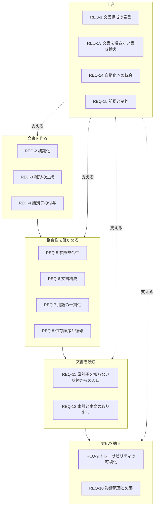

# 要件定義: mdtrace

mdtrace は、識別子でつながった Markdown 文書群をグラフとして扱うコマンドである。
文書の足場作り・整合性の検証・本文の取り出し・対応関係の追跡を 1 つの実行ファイルで提供する。

上流の記述が下流でどう扱われているかは、本来なら人が突き合わせる作業になる。
その突き合わせを機械で行えるようにすることが、この道具の目的である。
とりわけ AI エージェントが文書を書く場面では、出力を受け取る側の検査装置として働く。

特定の進め方に固有の語彙を持たず、どんな文書の連なりにも使えることを条件とする。
本書はそのうち、決定論的に振る舞うべき部分を要件として定める。

### 本書の位置づけ

この文書群は要件定義・アーキテクチャ設計・基本設計・詳細設計・テスト設計の 5 層を連ね、
下の層が上の層の識別子に言及することで対応づける。
本書は最上流にあたり、アーキテクチャ設計が各要件の識別子を参照する。

利用者向けの手引き（リファレンス）と用語集は連鎖に載せない。
どちらも対応表の段ではなく、どこからでも引かれる補助文書だからである。
本書が使う語（連鎖・細目・宣言・正典など）の定義は用語集が持つ。

### 要件の読み方

各要件は次の 3 節で構成する。

| 節 | 書く内容 |
|---|---|
| 概要 | その要件が何を達成するか |
| 受け入れ条件 | 満たされたと判断できる観測可能な条件 |
| 対象外 | 意図して扱わない範囲。実装しない判断を残すために書く |

「対象外」を明示するのは、後から読む人と AI が、
やり残しなのか意図した除外なのかを区別できるようにするためである。

### 要件の全体像

## REQ-1: 文書構成の宣言

### 概要
どんな文書タイプをどの順に連ねるかを、設定の宣言だけで決める。
道具の側は文書タイプ名も段数も持たず、特定の進め方に固有の語彙を中核に入れない。
この要件が満たされない限り、以降のすべての要件は「ある進め方でだけ動く道具」の要件になる。

### 受け入れ条件
- [ ] 連鎖の段数・文書タイプ名・識別子の書式が、宣言だけから決まる
- [ ] 宣言の無いファイルには、名前がどうであれ文書タイプも識別子の書式も付かない
- [ ] 宣言でファイルをまとめて指定でき、同じ文書タイプのファイルが増えても宣言は増えない
- [ ] まとめて指定した文書にも、順序と依存の検証が同じように効く
- [ ] 設定を書き戻しても、まとめた指定はそのまま保たれる
- [ ] 連鎖に載せない文書タイプを宣言でき、それは対応表の列にならない
- [ ] 宣言の不備は読み込み時に、検証の不合格とは区別できる形で報告される
- [ ] 同じ設定を指していれば、どの作業ディレクトリから実行しても同じ宣言に行き着く

### 対象外
文書の分割方針そのものの決定。宣言の自動生成。
設定にある項目を、同じ効果のコマンドライン引数で二重に持つこと。

## REQ-2: 作業開始時の初期化

### 概要
新しいプロジェクトで、各サブコマンドが共有する設定と、必須セクションの定義を用意する。
文書構成を手で書き起こさずに始められるようにする。

### 受け入れ条件

#### REQ-2.1: 構成の型の選択と生成物
- [ ] 用意された構成の型を選んで、文書と依存関係を宣言した設定を生成できる
- [ ] 構成の型に既定を設けず、利用者が明示して選ぶ
- [ ] 生成する雛形の見出しに対応した必須セクション定義を同時に生成できる
- [ ] 必須セクション定義の置き場は設定が決める

#### REQ-2.2: 作り先の指定の検証
- [ ] 作り先の指定が互いに食い違っていれば受け付けない
- [ ] 2 つの書き先が同じ実体を指す指定は受け付けない
- [ ] 別の場所へ作るときは、いま使っている設定を持ち込まない

#### REQ-2.3: 既存の内容の保護
- [ ] 既存のファイルを誤って上書きしない
- [ ] 失敗した実行は生成物を中途半端な状態で残さない
- [ ] 生成する 2 つのファイルは揃って置き換わる
- [ ] 同じ設定を作り直すとき、構成の型が決めない設定は保たれる

### 対象外
文書ディレクトリの構成そのものの決定。
構成の型を利用者が定義する仕組み（組み込みの型から選ぶ）。

## REQ-3: 文書雛形の生成

### 概要
文書タイプごとの雛形を生成し、人と AI が書き始める前に見出し構造と必須セクションを与える。
白紙から書くと必須セクションの欠落が後段の検証で初めて分かるため、入口で形を与える。

### 受け入れ条件
- [ ] 文書タイプを指定すると、必須セクションを備えた雛形が得られる
- [ ] 参照元の文書を指定すると、その文書の識別子が参照として埋め込まれる
- [ ] 同じ文書タイプを複数ファイルへ分けても、識別子は重複しない
- [ ] 使える雛形の種類を一覧できる
- [ ] 雛形は設定で差し替えられ、差し替えると必須セクション定義もそれに追従する
- [ ] 書き換えずに結果だけを確かめられ、その判定は実際に書くときと同じである

### 対象外
文章そのものの生成。雛形の穴埋めは利用者と AI が行う。

## REQ-4: 見出しへの識別子の付与

### 概要
見出しに一意な識別子を機械的に付与し、文書間の参照を成立させる。
採番を人が行うと、文書を分けた瞬間に重複と欠番が入り込む。

### 受け入れ条件

#### REQ-4.1: 連番の採番
- [ ] 指定した書式に従って、未採番の見出しへ識別子を振れる
- [ ] 既にある識別子は書き換えず、連番はその続きから振られる
- [ ] 連番は同じ書式を共有する文書全体で 1 本として払い出される
- [ ] コードブロック内の見出しに見える行は対象にならない
- [ ] 採番する見出しレベルを指定でき、複数のレベルをまとめて対象にできる
- [ ] 識別子の書式は宣言が正典で、宣言のある文書へ別の書式を指示できない

#### REQ-4.2: 階層識別子の認識
- [ ] ドットで繋いだ階層識別子を、上位とは別の識別子として認識できる
- [ ] 階層識別子があっても、連番は最上位の番号だけを見て続きが振られる

#### REQ-4.3: 参照の目印
- [ ] 参照の目印を、参照を持たないセクションにだけ入れられる
- [ ] 目印は繰り返し実行しても増えない

### 対象外
識別子の意味づけや並び替え。階層識別子の自動採番（振るのは人）。
識別子の振り直しと、それに伴う参照の追従書き換え
（変更前の影響の確認は REQ-10 が担い、書き換えは人が行う）。

## REQ-5: 参照整合性の検証

### 概要
文書中で参照された識別子が実際にどこかで定義されているか、
また同じ識別子が二重に定義されていないかを検証する。
階層識別子については、名前が主張する親子と文書の構造が一致しているかも検証する。

### 受け入れ条件
- [ ] 未定義の識別子への参照を、ファイル名と行番号付きで報告する
- [ ] コードブロックや行内コードに書かれた使用例は参照として扱わない
- [ ] 識別子の重複定義を検出する
- [ ] 連番の欠番を任意で検出でき、番号帯を分けただけの構成を誤って指摘しない
- [ ] 階層識別子の名前上の親が構造上の親と食い違っていれば報告する

### 対象外
参照の意味的な妥当性の判断。

## REQ-6: 文書構成の検証

### 概要
文書タイプごとに定めた必須セクションが備わっているかを検証する。
形が揃っていることを機械で保証し、書き手が中身に集中できるようにする。

### 受け入れ条件
- [ ] 文書タイプごとに必須セクションの欠落を報告する
- [ ] 必須セクションの並び順を検査できる
- [ ] 中身も下位の見出しも無いセクションを報告する
- [ ] 連鎖に載る文書タイプが、定義を欠いたまま黙って検査対象から外れない
- [ ] 検査そのものを明示的に無効化できる
- [ ] 検査の単位は、その文書に実在する最も浅い識別子の見出しレベルに揃う
- [ ] 検査の結果が、対象の与え方（全体か 1 ファイルか）で変わらない

### 対象外
文体・語尾の統一など文章校正。セクションの中身の妥当性。

## REQ-7: 用語の一貫性の検証

### 概要
用語の定義を 1 か所に集め、そこで挙げた別表記が正式な用語の代わりに使われていないかを検証する。
用語集は専用の書式を持たず、識別子付きセクションで書かれた 1 つの文書タイプとして扱う。

### 受け入れ条件
- [ ] 用語集が挙げる別表記が、正式な用語の代わりに使われていれば検出できる
- [ ] 用語も他の識別子と同じように索引・影響範囲・参照整合性の対象になる
- [ ] 用語集の文書自身は検査の対象にならない
- [ ] どの文書タイプを用語集とみなすかを設定で決められる

### 対象外
用語集に無い語の発見。何を用語とするかの判断は人が行い、道具は決めたことが守られているかだけを見る。
訳語の提案や自動翻訳。用語集への書き込み（見出しは人が書き、採番だけを道具が行う）。

## REQ-8: 依存順序と循環の検証

### 概要
参照が宣言した依存の向きに沿っているか、また文書どうしの依存宣言に循環がないかを検証する。
向きが崩れると、対応表も影響範囲も意味を失う。

### 受け入れ条件
- [ ] 宣言した依存の向きに反する参照を、ファイル名と行番号付きで報告する
- [ ] 依存先として宣言されていない文書の識別子を参照したことを報告する
- [ ] 文書どうしの依存宣言の循環を列挙できる
- [ ] 循環の一員である文書は、始点でなくても単独の検証で報告される
- [ ] 循環に加わっていない文書だけを検証したときは報告しない
- [ ] 連鎖に載らない補助文書の識別子は、どこから参照しても順序違反にならない

### 対象外
循環の自動解消。識別子どうしの相互参照（同じ節の関連づけなど、正しい書き方である）。

## REQ-9: トレーサビリティの可視化

### 概要
上流から下流への対応関係を表として出力する。
何をどの順に連ねるかは設定の宣言に従い、特定の進め方に固有の段数や文書タイプ名を道具側に持たない。

### 受け入れ条件
- [ ] 起点ごとに対応する下流を、連鎖の段ごとに一覧できる
- [ ] 対応の欠落を状態として区別できる
- [ ] 連鎖の段数が 2 段でも 5 段でも、列と判定が宣言に追従する
- [ ] 列の見出しは設定の文書タイプ名から作られる
- [ ] 途中の段が空なら、下流を直接参照していても経路として数えない
- [ ] 細目に分解した要素は、細目ごとの対応を集めて判定する（すべて満たせば完了、一部なら部分）
- [ ] 対応表が「下流なし」と判定した起点から、影響範囲が下流の段へ直接届くことはない（同じ段の別の識別子を経由した先は影響範囲に含まれる）
- [ ] 文書へ貼れる形と、機械可読な形の双方で出力できる

### 対象外
対応関係の自動推定。参照として明示されたものだけを辿る。
対応の強さや重みの表現。

## REQ-10: 影響範囲と欠落の検出

### 概要
識別子を変更したときに影響が及ぶ範囲と、下流へ辿り切れない識別子を検出する。
変更の前に影響を見て、変更の後に取り残しを見る。

### 受け入れ条件
- [ ] 指定した識別子から直接および間接の影響先を列挙できる
- [ ] 追跡する深さを指定できる
- [ ] 連鎖の最終段まで辿れない識別子を、到達率とともに列挙できる
- [ ] 欠落の有無を終了コードで判別できる
- [ ] 連鎖の途中の段を起点にできる
- [ ] 関係を図として出力でき、識別子で絞り込める

### 対象外
影響の大きさの定量評価。

## REQ-11: 識別子を知らない状態からの入口

### 概要
識別子を知らない読み手（とくに AI エージェント）が、文書群のどこを読むべきかを決められるようにする。
全体を読ませずに、目的から該当箇所へ辿り着ける経路を用意する。

### 受け入れ条件
- [ ] 語を指定して、本文と見出しの表題から探せる
- [ ] 一致は識別子付きの節へ帰属し、どの節を読むべきかが分かる
- [ ] 一致した行そのものが返り、本文を開かずに当たりを判断できる
- [ ] 絞り込む前の全件数が常に返り、絞り足りないことが分かる
- [ ] コードブロックの中は探索の対象にならない
- [ ] 一致が無いことは不合格として扱わない

### 対象外
語の意味による検索や類似度の判定。索引の事前構築。

## REQ-12: 索引と本文の取り出し

### 概要
分割された文書群から、識別子の所在と該当箇所の本文を、道具を通じて取り出せるようにする。
Markdown を直接開かずに構造と本文を得られることが、大きくなった文書群を扱う前提になる。

### 受け入れ条件
- [ ] 識別子・文書タイプ・所在・表題・参照関係を一覧できる
- [ ] 指定した識別子のセクションだけを、下位の見出しを含めて取り出せる
- [ ] 一覧は機械可読な形式でも出力できる
- [ ] 関係を含まない軽い目次を出力でき、識別子が増えても全体を見渡せる
- [ ] 軽い目次と関係を含む索引は、同じ識別子の集合を返す

### 対象外
本文の要約や書き換え。

## REQ-13: 利用者の文書を壊さない書き換え

### 概要
道具が文書を書き換えるとき、利用者が書いた内容と体裁を保ち、
途中で失敗しても元の状態が残るようにする。
文書を書き換える道具が文書を壊すなら、他のどの要件を満たしても使われない。

### 受け入れ条件

#### REQ-13.1: 内容と体裁の保持
- [ ] 文書の書き換えは、元の改行コード・見出し形式・利用者が書いたコメントを保つ

#### REQ-13.2: 途中で失敗しても壊さない
- [ ] 書き込みに失敗しても元の内容が残る
- [ ] 書き換えた文書は元の許可属性を引き継ぐ
- [ ] 複数の文書を渡したとき、途中で止まれば 1 つも書き換わっていない

#### REQ-13.3: 書き先の判定
- [ ] 書き先が別名（記号リンク）なら、指し先の実体を置き換える
- [ ] 通常のファイル以外や書けない場所は、書き込みを始める前に断る
- [ ] 書き先を受け取るすべてのサブコマンドで、この判断が同じである

#### REQ-13.4: 書き換えずに確かめる
- [ ] 文書を書き換えるサブコマンドは、書き換えずに結果だけを見られる

### 対象外
Markdown の再整形。書き換えの取り消し（版管理に委ねる）。
設定ファイルへ利用者が書いたコメントの保存（設定は構造として書き戻すため失われる）。
複数プロセスの同時実行に対する排他制御（版管理と実行の直列化に委ねる）。

## REQ-14: 自動化への統合

### 概要
検証と追跡の結果を終了コードと機械可読な形式で返し、自動化された検査に組み込めるようにする。

### 受け入れ条件
- [ ] 合格・不合格・設定や引数の不備を終了コードで区別できる
- [ ] 指摘に深刻度があり、不合格にする水準を実行時に引き上げられる
- [ ] 検証結果と追跡結果を機械可読な形式で出力できる
- [ ] 端末以外へ出力するときは装飾を抑制する
- [ ] 結果をファイルへ残せる
- [ ] 空の一覧が、項目の欠落ではなく空として表現される

### 対象外
通知やダッシュボードなど、結果の配信手段。検証結果の履歴管理。

## REQ-15: 前提と制約

### 概要
すべての要件が暗黙に置いている前提と、道具の形に対する制約を明文化する。
やり方の選定（どの実装や拡張を使うか）は設計が決め、ここでは外から観測できる約束だけを定める。

### 受け入れ条件
- [ ] 道具は 1 つの実行ファイルとして配布でき、実行時に他のランタイムや外部コマンドを要しない
- [ ] 文書は UTF-8 として読み書きし、他のエンコーディングの検出や変換は行わない
- [ ] 見出し・コードブロック・行内コードの解釈は CommonMark に従う
- [ ] Linux（amd64）で動作する。記号リンクと許可属性の扱い（REQ-13）を含む

### 対象外
Linux（amd64）以外の OS・アーキテクチャでの動作の保証。
性能の定量的な保証。規模の上限や実行時間は約束せず、測り方だけを文書に書く。
メッセージの多言語化。
