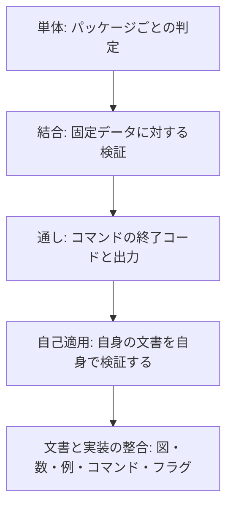

# テスト設計: mdtrace

本書は、何をどう検査するかを定める。連鎖の最終段にあたるので、
ここまで辿れない要件は「決めたが確かめていないこと」として `mdtrace gaps` が報告する。

検査の方針は 1 つである。**約束したことは機械で守り、機械で守れないものは
守れないと明記する。**人が気づく話にしておくと、変更のたびに必ず取りこぼす。

### 本書の位置づけ

本書は詳細設計を受ける。各項目の冒頭で、その検査が守る実装の識別子に言及する。

### 設計の読み方

各項目は次の 3 節で構成する。

| 節 | 書く内容 |
|---|---|
| 観点 | 何が壊れうるか。この検査が守るもの |
| 検査方法 | どう検査するか。担当するテスト |
| 合格条件 | 合格と判断できる条件 |

「観点」を先に書くのは、**検査方法から書くと、書きやすい検査だけが増える**ためである。
壊れうることを先に挙げ、それを守る手段を後から選ぶ。

### 機械で守れないもの

次の 3 つは機械で守れない。いずれも過去に実際に見落とした種類なので、
区切りごとに人とエージェントがレビューする。

- 設計文書の散文が**古い設計を述べていないか**。機能が消えても文は残る
- 出力例の**値**が実際の出力と一致するか（項目名は機械が見る）
- 説明の理由づけが現在の判断と合っているか

数を主張したら検査を足す。検査できない数は書かない。
行数・カバレッジ・バイナリサイズのように触るたびに変わる値は書かず、
求め方だけを書く。書けば必ず腐り、腐った数字は無いより悪い。

この節を識別子付きの項目にしないのは、**検査の設計ではないから**である。
観点も検査方法も合格条件も書けないものを項目にすると、
自己言及の合格条件（「この節に列挙されている」）を書くことになる。

### 検査の層

固定データは系統ごとに分ける。

| 系統 | 内容 |
|---|---|
| `testdata/good` | 全ルールが通る最小構成 |
| `testdata/bad` | 違反を 1 つずつ仕込んだ異常系 |
| `testdata/hierarchy` | 階層識別子の整合・不整合を並べた構成 |
| `testdata/term-id-alias` | 用語の別表記が識別子の接頭辞と同じ綴りの構成 |
| `testdata/skip-stage` | 連鎖外のタイプを経由する参照を並べ、段の制約を検査する構成 |
| `testdata/dup-nested` | 重複識別子の自己包含・相互包含だけを持つ構成 |
| `docs` | mdtrace 自身の文書一式。実プロジェクト規模の正常系 |

`t.TempDir()` にその場で組み立てた構成も、エンジン（`Run` など）を通して検証する点は
固定データと同じなので、結合層に属する。両者の違いは層ではなく持ち方である。

使い分けの基準は「複数のテストにまたがって使うか」に置く。`testdata/` の系統は
複数のテストから共有するので、系統ごとに意味を固定して壊れないようにする。
1 本のテストのためだけに要る形——特定の設定の組み合わせ・記号リンク・壊れた宣言など——を
固定データへ足すと、それを使う他のテストの前提まで変えてしまう。
そのときは `t.TempDir()` にその場で組み立て、固定データを増やさない。

## TD-1: 文書の解析

DD-1 の解析が、参照・用語・検索で同じ判断を返すことを守る。

### 観点
解析の判断が分かれると、対応表と検索が別の文書を見ていることになる。
とくに壊れやすいのは、コードの範囲の除外と、参照の帰属である。
コードブロックの形式（バッククォート・チルダ・字下げ・入れ子のフェンス）と、
行内コードの形式（単一・二重・複数行にまたがるもの）を取りこぼすと、
使用例として書いた識別子が対応関係を作る。

### 検査方法
`internal/parser/parser_test.go` で、見出しの抽出・参照の帰属・
本文の行の取り出しを検証する。
コードブロックはすべての形式を 1 つの文書に並べ、本文だけが残ることを確かめる。
行内コードも単一・二重・複数行の 3 形式を並べる。

本文の行は解析結果を経由して取り出す。算出の経路が 1 本であることを、
検査もその経路を通ることで示す。

### 合格条件
- [ ] 見出しの識別子・表題・レベル・支配範囲が取り出せる
- [ ] コードブロックと行内コードに書かれた識別子が参照にならない
- [ ] 参照が直近の識別子付き見出しへ帰属する
- [ ] フェンス（バッククォート・チルダ）・字下げ・入れ子のフェンスが本文から除かれる

## TD-2: 設定の読み込みと展開

DD-2 の宣言の扱いが、実行場所や書き戻しで変わらないことを守る。

### 観点
宣言と実体を分けて持つ構造は、片方だけを使う実装へ簡単に退化する。
退化すると、まとめ指定を書いた設定が書き戻しでファイル一覧へ潰れる。

識別子の書式の変換も壊れやすい。英字と日本語で語句境界の扱いが違うので、
片方だけを検査していると、もう片方が一切一致しない状態に気づけない。

### 検査方法
`internal/config/config_test.go` で、書式から正規表現への変換、
宣言が無いときの扱い、パスの解決を検証する。
まとめ指定を含む設定で、対象文書の数と依存の判定を確かめる。
波括弧のまとめ指定と、別名ごしの綴りから宣言を引けることも並べる。

### 合格条件
- [ ] 英字で始まる書式と日本語で始まる書式が、どちらも一致する
- [ ] まとめ指定が実ファイルへ展開され、宣言の側は 1 件のまま残る
- [ ] 作業ディレクトリ基準と設定ファイル基準の双方でパスが解決できる
- [ ] 宣言の不備が読み込みの時点で誤りとして返る（終了コードへの変換は TD-10 が見る）

## TD-3: 識別子グラフ

DD-3 のグラフが、辺の種別を保ったまま探索できることを守る。

### 観点
辺の種別が失われると、網羅率に文書の構造が混ざる。
循環の列挙は辺の絞り込みが効かないので、絞ったグラフを作り忘れると
含有辺が循環として報告される。

図の出力では、記法で使えない文字を落とした結果、
日本語の識別子や文書タイプ名が同じ名前へ潰れる。

### 検査方法
`internal/graph/graph_test.go` で、到達可能集合・循環・部分グラフ・図の出力を検証する。
図は日本語の識別子と日本語の文書タイプ名を含む構成で確かめる。

### 合格条件
- [ ] 到達可能集合が距離付きで返る
- [ ] 下流の取得と辺の一覧が辺の種別で絞れる
- [ ] 日本語の識別子が図の中で別々の頂点として残る

## TD-4: 検証ルールの判定

DD-4 のルール群と DD-5 の用語集の読み取りが、
仕込んだ違反を過不足なく検出することを守る。

### 観点
ルールは「検出できない」だけでなく「検出しすぎる」ことでも壊れる。
とくに用語の別表記は深刻度が誤りなので、説明文から誤った別表記を作ると
正しい文書が不合格になる。

必須セクションの検査は、主レベルの概念が壊れると全滅する。
深い見出しへ識別子を振った瞬間に、細目が下位の見出しを持たないことを理由に
すべてが欠落として報告される。

### 検査方法
`testdata/good` と `testdata/bad` を用いて、ルールごとの検出内容と集計を検証する。
異常系は違反を 1 つずつ仕込むので、指摘の内容と位置がそのルールに帰属する。

用語は `pkg/verify/verify_test.go` で、登録済みの別表記を検出すること、
用語集自身を指摘しないこと、未登録の語を推測して指摘しないことを確かめる。
別表記が識別子の接頭辞と同じ綴りでも、識別子参照そのものを指摘しないことは
`testdata/term-id-alias` を用いて確かめる。
必須セクションの順序判定は `internal/rules/required_sections_test.go` が、
主レベルを検査単位にすることは `pkg/verify/verify_test.go` が、
用語の取り出しは `internal/terms/terms_test.go` が受け持つ。
依存順序の助言の向きと、空のまとめ指定の警告の帰属は
`internal/rules/dep_order_test.go` が、別名ごしの綴りで判定が変わらないことは
`internal/rules/dep_order_unix_test.go` が受け持つ。
階層識別子の判定は `testdata/hierarchy` を用いて、不一致と親の不在を警告し、
整合した入れ子・多段の階層・ドットを含まない細目を指摘しないことを確かめる。
判定の分岐そのものは `internal/rules/id_hierarchy_test.go` が、
名前上の親の算出は `internal/config/config_test.go` が受け持つ。

### 合格条件
- [ ] どのルールもそれぞれ違反を検出する
- [ ] 正常系の構成で指摘が 1 件も出ない
- [ ] 説明文の括弧から別表記が作られない
- [ ] 検査の結果が、対象の与え方（全体か 1 ファイルか）で変わらない

## TD-5: 文書を壊さない書き換え

DD-9 の採番と DD-6 の書き込みが、利用者の文書を保つことを守る。

### 観点
この道具が最も壊してはならないのは、利用者が書いた文書そのものである。
壊れ方は 3 通りある。体裁が変わる（改行コード・見出し形式・コメント）、
中身が失われる（書き込みの途中で失敗する）、
一部だけが書き換わる（複数文書のうち先の文書だけが変わる）。

採番はべき等でなければならない。繰り返し実行して結果が変われば、
版管理に無意味な差分が積み上がる。

### 検査方法
`pkg/scaffold/scaffold_test.go` で、複数ファイルにまたがる採番、
既存識別子の保持、改行コードと見出し形式の保持を検証する。
`internal/fileio/fileio_test.go` と `internal/fileio/fileio_unix_test.go` で、
許可属性の引き継ぎ・読み取り専用の拒否・名前付きパイプの拒否・
同じ実体への二重指定を並べる。

後続の文書で止まったとき、先行の文書が書き換わっていないことも確かめる。

### 合格条件
- [ ] 書き込みに失敗しても元の内容と許可属性が残る
- [ ] 途中で止まった実行が、1 つの文書も書き換えていない
- [ ] 繰り返し実行しても結果が変わらない

## TD-6: 構成の生成

DD-8 の生成が、そのまま検証を通る構成を作ることを守る。

### 観点
初期化が作った構成を、その直後に検証が不合格にするのが最悪の壊れ方である。
必須セクション定義を雛形から導いているので、
どちらか一方だけを変えるとこの状態になる。

作り直しの引き継ぎも壊れやすい。引き継ぎすぎると別の構成の設定が混ざり、
引き継がなさすぎると利用者が足した設定が黙って消える。

### 検査方法
生成物が組み込みの雛形と一致すること、既存ファイルを上書きしないこと、
同じ設定を作り直すと利用者の設定が残り、別の場所へ作ると混ざらないこと、
定義ファイルの置き場を変えてもそこへ書くこと、
食い違う作り先を弾くことを `cmd/mdtrace/mdtrace_test.go` で検証する。

引き継ぎの対象は `pkg/scaffold/init_test.go` が、設定の項目そのものから導いて確かめる。
項目を足したときに分類し忘れると落ちるので、検討漏れが起きない。

### 合格条件
- [ ] 生成した構成がそのまま検証を通る
- [ ] 構成の型が決めない設定だけが引き継がれる
- [ ] 失敗した実行が生成物を中途半端な状態で残さない

## TD-7: 検証の実行と集計

DD-10 のエンジンが、絞り込みや格上げで結果を歪めないことを守る。

### 観点
ルールを絞って実行したときに他のルールの結果が変わると、
「絞れば通る」という抜け道ができる。

補助設定が読めないときに合格として続けると、
定義ファイルを消した瞬間に検査が素通りする。

### 検査方法
`pkg/verify/verify_test.go` で、深刻度の格上げと集計の値を検証する。
絞り込みは、単独で実行した結果と全実行の結果を突き合わせて一致を確かめる。
比較しない検査では「絞れば通る」抜け道を見つけられない。
ルールごとの有効・無効の設定が全ルールを覆うことは
`internal/rules/rules_test.go` が、設定の項目そのものから導いて確かめる。
補助設定が読めない構成と空の構成は同じファイルが、
連鎖に載る文書タイプの定義を欠く構成は `cmd/mdtrace/mdtrace_test.go` が受け持つ。

### 合格条件
- [ ] 絞り込んで実行しても、実行したルールの結果が変わらない
- [ ] 格上げがすべての警告を誤りへ変える
- [ ] 補助設定の不備が合格にならない

## TD-8: 対応表と欠落

DD-11 の行の判定と DD-12 の出力が、段数に依らず一貫することを守る。

### 観点
対応表と影響範囲が食い違うと、どちらを信じてよいか分からなくなる。
とくに細目の畳み込みは、起点でだけ畳むと
「起点なら届いている／経路の途中なら届いていない」と割れる。

段数を固定した実装へ退化していないかも見る必要がある。
3 段でだけ動く実装は、3 段の構成では気づけない。

### 検査方法
`pkg/trace/trace_test.go` で、対応表と欠落の判定が一致することを、
段数の違う構成（2 段・4 段）で検証する。
細目の畳み込みは、親に付けた対応と細目に付けた対応の双方を並べ、
経路のどの段でも畳まれることを確かめる。
機械可読な出力に `null` が現れないことは、一覧が空になる経路も含めて確かめる。

### 合格条件
- [ ] 欠落が対応表の射影として一致する
- [ ] 列と判定が連鎖の宣言に追従する
- [ ] 含有辺が網羅の判定に混ざらない
- [ ] 空の一覧が空の配列として出る

## TD-9: 文書を読む経路

DD-13 の検索・索引・本文取得が、識別子を知らない読み手を導けることを守る。

### 観点
検索が使用例を拾うと、読み手は存在しない記述を読みに行く。
上限で切ったことを黙ると、読み手は「これで全部だ」と誤って判断する。

軽い目次が軽くなくなると、全体を見渡すという用途が失われる。

### 検査方法
`pkg/trace/search_test.go` で、コードブロック内の行を拾わないこと、
下位見出しの中の一致が直近の識別子へ属すること、
節に属さない一致が位置だけで返ること、
上限で切っても総数が残ることを検証する。
索引は `pkg/trace/trace_test.go` が受け持ち、件数と所在、取り出した本文の範囲を確かめ、
木の形が関係を載せず、機械可読な形の半分未満に収まることも固定する。

### 合格条件
- [ ] 一致が識別子付きの節へ帰属する
- [ ] 絞る前の全件数が常に返る
- [ ] 一致が無くても終了コードが 0 である
- [ ] 木の形に関係が載らず、機械可読な形の半分未満に収まる

## TD-10: 終了コードと対象の与え方

DD-7 の共通の入口と DD-15 のコマンド定義が、契約どおり終了することを守る。

### 観点
終了コードの意味が崩れると、自動化された検査が意味を失う。
とくに「文書を直すべきか、設定を直すべきか」の切り分けができなくなる。

対象の展開では、名指しの打ち間違いが「何も起きない成功」になる壊れ方が危険である。

### 検査方法
各コマンドの終了コードを、合格・不合格・設定不備の 3 通りについて検証する。
対象の展開は `internal/cli/cli_test.go` で、綴りの違う同じ実体・
まとめ指定の記号を含む名前・切れた別名・読めない名指し・
ディレクトリへの別名を並べて確かめる。
別名のディレクトリを潜る走査（循環・入れ子の切れた別名）は
`internal/cli/cli_unix_test.go` が受け持つ。

### 合格条件
- [ ] 終了コードが 0 / 1 / 2 の約束どおりに返る
- [ ] 読めない名指しが設定の不備として止まる
- [ ] まとめ指定は 0 件でも通るが、どの引数も一致しなければ止まる
- [ ] 別名ごしの同じ文書が 1 つとして扱われる

## TD-11: 文書と実装の整合

DD-15 のコマンド定義、DD-2 の設定の型、DD-12 と DD-13 が返す出力の項目名が、
文書の記述と食い違わないことを守る。

### 観点
文書と実装の食い違いは、レビューで最も見落とされる種類の欠陥である。
コマンドを足して文書に書き忘れれば利用者は存在を知る手段が無く、
コマンドを消して文書に残せば、読んだとおりに実行して失敗する。

図はとくに危険である。読み手が構造をそのまま信じるので、
ずれたときの誤解が文章より大きい。しかも図はコードブロックの中なので、
参照整合性の対象にならない。採番を振り直したときも図だけが取り残される。

数の主張は、書いた瞬間から腐り始める。

### 検査方法
`cmd/mdtrace/docs_test.go` が、コマンド・フラグ・関心の分類・
主張された数・Go の版・設定例・機械可読な出力例を突き合わせる。
対象の文書は一覧を手で持たず、リポジトリを歩いて集める。
手で並べると、文書を足したときに検査から漏れ、外しても誰も気づかない。

`cmd/mdtrace/diagram_test.go` が、文書中のパッケージ依存図の辺と実際の
`import` を過不足なく突き合わせる。図に粒度の注記を添えるだけでは、
注記自体が実態とずれたときに誰も気づけない。**描くなら全部描く**という約束にする。
対象の文書はこちらも歩いて集める。図でないの mermaid は依存図とみなさず飛ばすので、
一覧を手で持つ必要が無い。

詳細設計が挙げるパスの実在と、逆にテストを除くすべてのソースが
いずれかの項目に含まれることを、`pkg/verify/own_docs_test.go` が双方向で確かめる。

図の中の識別子は `pkg/trace/own_docs_test.go` が見る。未定義の識別子を指していないこと、
1 つの図の中で同じ識別子が 2 つのノードに付いていないことを確かめる。
後者は、採番を振り直したときの取り残しが「実在する別の識別子を指す」形で残るためである。

### 合格条件
- [ ] すべての末端サブコマンドが利用者向けの文書に載っている
- [ ] 文書が実在しないコマンドやフラグを案内していない
- [ ] 図の辺と実際の `import` が過不足なく一致する
- [ ] 図が指す識別子が実在し、1 つの図の中で重複しない
- [ ] 詳細設計とソースの対応が双方向で保たれている
- [ ] 主張された数が実態と一致する

## TD-12: 構成の型が実際に使えること

DD-14 の構成の型と DD-8 の生成が、宣言だけで一巡することを守る。

### 観点
組み込みの型が増えたときに、新しい型だけが動かない状態に気づけないと、
「どんな文書の連なりにも使える」という主張が空手形になる。

**いまは組み込みの型が waterfall だけなので、この検査が示せるのはそこまでである。**
特定の進め方に寄らないことの裏づけは、`testdata/good` が
組み込みの型に無い文書タイプと 3 段の連鎖で検証と対応表を通ること、
そして連鎖の段数が可変であることを段数の違う構成で確かめること
（TD-8）に依っている。型を足したときに、この節の主張も強くなる。

### 検査方法
組み込みの型を一覧から取り、すべての型について
初期化 → 雛形の生成 → 採番 → 検証が通ることを `cmd/mdtrace/mdtrace_test.go` で確かめる。
型の一覧を書き写さないので、型を足せば検査対象も自動で増える。

### 合格条件
- [ ] すべての構成の型で、生成した文書が検証を通る
- [ ] 型を足したときに、検査対象が自動で増える

## TD-13: 自身の文書への適用

DD-8 が生成した構成と DD-2 が読む設定で、道具が自身の文書一式（`docs`）を
扱えることを実プロジェクト規模で守る。

### 観点
最小構成で通ることと、実際の規模で通ることは別である。
`testdata/good` は数個の識別子しか持たないので、
連鎖が 5 段になったときの畳み込みや、識別子が数十件になったときの
帰属の判定を確かめられない。

自身の文書を自身で検証していないと、利用者に勧めている使い方を
自分では試していないことになる。

### 検査方法
`pkg/verify/own_docs_test.go` が、自身の文書一式に対して全ルールを実行し、
誤りも警告も 0 件であることを確かめる。検証対象のファイル数が
設定の宣言した数と一致することも見る。

`pkg/scaffold/own_docs_test.go` が、文書から識別子を取り除いて振り直し、
元の内容と一致することを確かめる。一致すれば、採番は手書きではなく
道具の出力だと言える。接頭辞は設定から取るので、
文書タイプを足したときに剥がし漏れない。
階層識別子（細目）は人が振るものなので、取り除く対象にも比較にも含めない。
残したまま振り直すと、連番が階層識別子の最上位の番号の続きになる。

`pkg/trace/own_docs_test.go` が、自身の対応表が要件から最終段まで途切れないことと、
連鎖の途中を起点にした欠落が、冒頭に「どの要件にも属さない」と宣言した
横断決定と過不足なく一致することを確かめる。許す識別子は宣言から導き、
テストへ書き写さない。

再生成の手順は `scripts` 配下に置く。生成物が現状と一致することは
上記のテストが継続的に確かめる。

### 合格条件
- [ ] 自身の文書一式が、誤りも警告も 0 件で検証を通る
- [ ] 識別子を剥がして振り直すと、元の内容と一致する
- [ ] 設定が、構成の型からの生成物そのものである
